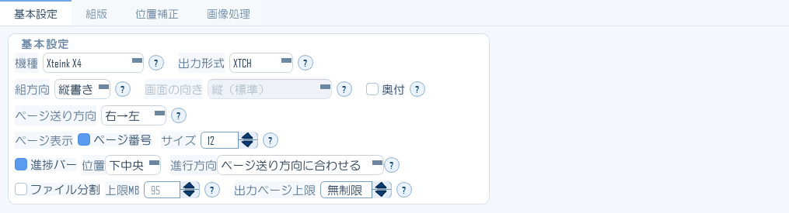
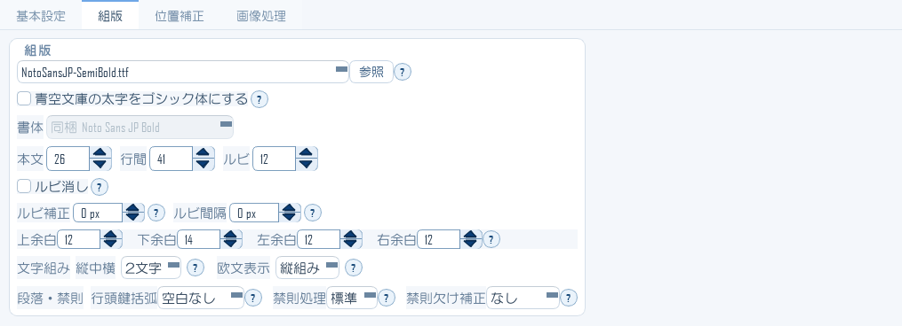
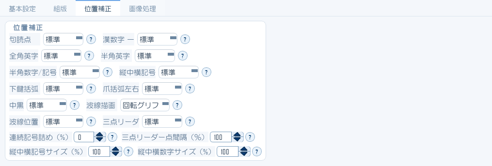
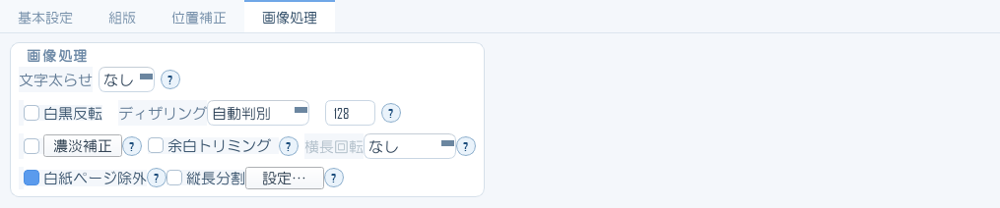

# 日本語XTC GUI Studio マニュアル

EPUB / ZIP / CBZ / CBR / RAR / PDF / TXT / Markdown / Web記事 / Web小説 を、
X3・X4など縦書き対応端末向けの XTC / XTCH 形式へ変換するデスクトップアプリの使い方ガイドです。

対象バージョン: **v3.2（Full版）**。
Trial版との違いは [17. 版（エディション）の違い](docs/17-editions.md) にまとめています。

> 📸 メイン画面・設定の3ブロック・プリセットパネル・小説URLの画面は v3.2 で撮り直しています。
> ダイアログ類（書籍情報・XTCツール・記事URLなど）の写真は v3.1.2.12 のもので、
> 画面の作りは変わっていません。

---

## v3.1.2 からの主な変更点

v3.1.2 から乗り換える方は、まずここを確認してください。

| 変更 | 説明している章 |
|---|---|
| **narou.rs 連携と登録作品の管理**。連載中のWeb小説を登録し、新着話を取り込んで更新できる | [11章](docs/11-narou.md) |
| **縦長分割**。マンガの縦長ページを、端末を横に倒して読む向きの複数の面に分ける | [13章](docs/13-image-correction.md#縦長分割) |
| **白紙ページ除外**。画像アーカイブ・PDFの白紙ページと、縦長分割で生じた白紙面を除く | [13章](docs/13-image-correction.md#白紙ページ除外) |
| **青空文庫の注記を拡張**。罫囲み・小書き・訓点・くの字点・地付きなど | [10章](docs/10-aozora.md#対応している青空文庫の注記) |
| **青空文庫の太字をゴシック体にする** | [3章](docs/03-typesetting.md#青空文庫の太字をゴシック体にする) |
| **ルビ間隔**（本文との距離）を追加。ルビ補正は流れ方向の調整に | [3章](docs/03-typesetting.md#フォントサイズ余白) |
| **三点リーダー点間隔・縦中横数字サイズ**を追加。位置補正の対象を拡大 | [4章](docs/04-position.md) |
| **［読み直し］（F5）** と「元ファイルの変更を知らせる」。エディタで直した原稿をすぐ確認できる | [1章](docs/01-getting-started.md#元ファイルを直しながら確認する) |
| **RAR / CBR の展開用に 7-Zip を同梱**。別途の解凍ソフトは不要 | [18章](docs/18-faq.md#rarcbrを開くのに解凍ソフトは要りますか) |
| **設定引き継ぎツール**が、組版・出力の設定そのものと書籍情報も運ぶように | [1章](docs/01-getting-started.md#新しい版へ乗り換えるとき設定引き継ぎツール) |

---

## 目次

### メイン画面

| 章 | 内容 |
|---|---|
| [1. はじめに・画面の見方](docs/01-getting-started.md) | 3つのペインとツールバー、歯車メニュー、設定の引き継ぎ |
| [2. 基本設定ブロック](docs/02-basic-settings.md) | 機種・出力形式・組方向・奥付・ファイル分割・Markdownレイアウト |
| [3. 組版ブロック](docs/03-typesetting.md) | フォント・ルビ・余白・縦中横・禁則・進捗バー・画像処理 |
| [4. 位置補正ブロック](docs/04-position.md) | 記号や英数字の位置と間隔の微調整（縦書き専用） |
| [5. 変換の実行と結果の確認](docs/05-convert-and-check.md) | 出力設定・変換中・変換結果タブ・ログタブ |
| [6. プレビュー（右ペイン）](docs/06-preview.md) | 2つのモード・表示範囲・実寸・ガイド・ページ移動 |
| [7. プリセット](docs/07-presets.md) | 設定の保存と呼び出し、表示言語 |

### 書籍としての仕上げ

| 章 | 内容 |
|---|---|
| [8. 書籍情報・表紙兼扉](docs/08-book-metadata.md) | **v3の中心機能**。表紙／メタデータ／目次／サムネイルの4タブ |

### 変換元を用意する

| 章 | 内容 |
|---|---|
| [9. Web記事を取り込む（記事URL）](docs/09-article-url.md) | 本文抽出／本文＋画像／Web表示の3方式 |
| [10. 青空文庫の作品を取り込む](docs/10-aozora.md) | 作品検索とダウンロード、対応している注記 |
| [11. Web小説をEPUB化する（小説URL）](docs/11-narou.md) | narou.rs 連携、登録作品の管理と更新 |
| [12. フォルダをまとめて変換する](docs/12-folder-batch.md) | 一括変換とその注意点 |
| [13. 画像・スキャンPDFの下ごしらえ](docs/13-image-correction.md) | 濃淡補正、白紙ページ除外、縦長分割 |

### 出力後の操作

| 章 | 内容 |
|---|---|
| [14. XTCツール](docs/14-xtc-tools.md) | 書籍情報・目次の編集、XTG/XTH↔PNG変換、検証 |
| [15. 大きなEPUBを巻分割する](docs/15-epub-split.md) | EPUB分割・EPUB切出し |
| [16. X3/X4へ接続して転送する](docs/16-device-transfer.md) | かんたん接続ガイド |

### 資料

| 章 | 内容 |
|---|---|
| [17. 版（エディション）の違い](docs/17-editions.md) | Full版とTrial版でできること |
| [18. よくある質問・注意点](docs/18-faq.md) | トラブル時の確認先と既知の制限 |
| [19. 変換後サンプル集](docs/19-samples.md) | 入力形式ごとの実際の出力と、その設定へのリンク |

---

## 設定の並べ方が2通りあります（a版・b版）

v3.2 には、**設定エリアの並べ方だけが違う2つの版**があります。設定項目そのもの、変換の結果、出力されるファイルは**まったく同じ**です。

| | 設定エリア |
|---|---|
| **a版** | 「基本設定」「組版」「位置補正」の**3つのブロックを縦に並べます**（v3.1 までと同じ並べ方） |
| **b版** | 「基本設定」「組版」「位置補正」「画像処理」の**4つのタブを切り替えます** |

このマニュアルの本文と画面写真は **a版** のものです。b版をお使いの場合は、各章の先頭にある「b版（タブ表示）では」の注記を読んでください。

### 設定項目の場所（a・bの対応表）

項目の名前と意味は同じで、置き場所だけが違います。**移動したのは次の4組だけ**です。

| 設定 | a版（ブロック） | b版（タブ） |
|---|---|---|
| ディザリング・しきい値・白黒反転・濃淡補正・余白トリミング・横長回転・白紙ページ除外・縦長分割（16項目） | 組版 → 画像処理の枠 | **画像処理** |
| ページ番号・ページ番号サイズ・進捗バー（位置・進行方向）（5項目） | 組版 | **基本設定** |
| Markdownレイアウト（章改ページ・水平線・表・表罫線・見出しサイズ階層・リストのネスト字下げ）（7項目） | 基本設定 → Markdownレイアウトの枠 | **組版** |
| 文字太らせ（1項目） | 基本設定 | **画像処理** |

残りは場所が変わりません。

| 設定 | a版（ブロック） | b版（タブ） |
|---|---|---|
| フォント・サイズ・余白・ルビ（ルビ消しを含む）・文字組み・段落・禁則・青空文庫の太字（18項目） | 組版 | 組版（同じ） |
| 機種・出力形式・組方向・画面の向き・奥付・ページ送り方向・ファイル分割・出力ページ上限・プロファイル（11項目） | 基本設定 | 基本設定（同じ） |
| 位置補正のすべて（16項目） | 位置補正 | 位置補正（同じ） |

> プリセット・表示言語・プレビューの操作・ログの保存先は、どちらの版でもタブの外にあり、同じ場所です。

---

## 📥 端末・EPUBリーダーで読む ／ フォーマット比較用データ

このマニュアルは、X3・X4で読める **XTC / XTCH 版**と、**EPUB版**でも配布しています
（画面写真入り）。XTC版は日本語XTC GUI Studio 自身で変換したものです。

**同じ内容を形式だけ変えて用意してあるので、比較用のテストデータとしても使えます。**
「XTCH（4階調）とXTC（2階調）で実際どれくらい見え方が違うのか」を、
自分の端末で並べて確かめられます。

→ **[ダウンロードと比較のしかたはこちら](download/)**

> ダウンロード版は v3.1.2.9 の時点の内容です。v3.2 の変更点は、このWeb版を参照してください。

---

## はじめての方へ

まず [1. はじめに・画面の見方](docs/01-getting-started.md) を読み、
実際に1冊変換してみてください。基本の流れは5ステップです。

1. ファイルを開く
2. プリセットを選ぶ
3. 必要なら微調整
4. 変換実行
5. 右ペインで確認

> 📸 **画面写真について**: このマニュアルの画面写真は、実際のアプリ画面をオフスクリーン描画で
> 書き出したものです（実デスクトップの撮影ではありません）。設定は初期状態から作成しており、
> 特定の利用者の作業履歴は写っていません。本文中の説明は、アプリ内のヘルプ文言に基づいています。

---

## この文書について

作成: 日本語XTC 開発チーム。
不明点や間違いに気づいたら、Issueまたはコメントで教えてください。
