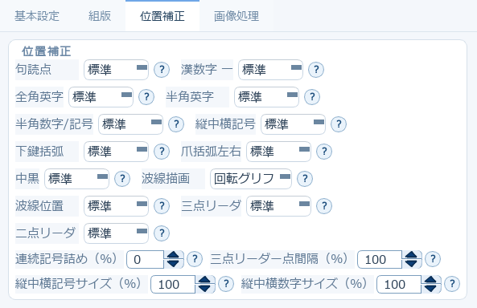
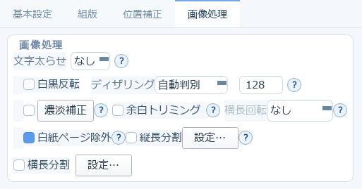

# 日本語XTC GUI Studio マニュアル

EPUB / ZIP / CBZ / CBR / RAR / PDF / TXT / Markdown / Web記事 / Web小説 を、
X3・X4など縦書き対応端末向けの XTC / XTCH 形式へ変換するデスクトップアプリの使い方ガイドです。

対象バージョン: **公開中の v3.2.1（Full版）**。タイトルバーには `v3.2.1b` と表示されます。
開発中の **v3.3（β版・未公開）で初めて入る機能**には **【v3.3から】** と書いています。v3.2.1 にはその機能はありません。
Trial版との違いは [17. 版（エディション）の違い](docs/17-editions.md) にまとめています。

> 📌 **Simple Reader OS（SROS）を使う方へ**: 出力形式「XTCH v2」・LZ4圧縮・マンガ用の機種とプリセットは、
> X3/X4/X4 Pro 用のカスタムファームウェア **SROS 専用**の機能です。純正ファームウェアでは開けません。
> → [21. Simple Reader OS（SROS）で読む](docs/21-sros.md)

> 📸 メイン画面と設定の4タブの写真は v3.3 から書き出したものですが、v3.2.1 と同じ作りです。
> 小説URLの写真は v3.3 の画面で、登録作品一覧の列とボタンが v3.2.1 と一部違います（[11章](docs/11-narou.md)）。
> ダイアログ類（書籍情報・XTCツール・記事URLなど）の写真は以前の版のもので、画面の作りは変わっていません。

---

## 公開版 v3.2.1 と v3.3 の違い

### 【v3.3から】v3.3 で加わる機能（未公開）

次の機能は v3.3 で初めて入ります。公開中の v3.2.1 にはありません。
どれも小説URLの「登録作品」（narou.rs方式）にかかわる機能です。

| v3.3 の新機能 | v3.2.1 では | 説明している章 |
|---|---|---|
| **連載の更新管理**。登録作品の「続き」（手元のEPUBにあって、まだXTCにしていない話）を数え、**続きの話だけのXTC**（書名は例: `作品名 第129-132話`）を作れる | 全話を変換し直す | [11章](docs/11-narou.md#v33から連載の更新管理続きだけxtc) |
| **変換済みの自動記録**。Studioで変換が終わると、登録作品の「XTC状態」と続きの起点が自動で進む | 変換後に［ここまで変換済みにする］を手で押す | [11章](docs/11-narou.md#変換済みの記録自動記録) |
| **［選択作品だけ取得］**。登録作品のうち1作品だけをサイトから取り直す | ［サイトから新着を取得］で全作品を取り直す | [11章](docs/11-narou.md#v33で増えるボタン) |
| **「次の一手」の案内**。登録作品一覧の下に、いま押すべきボタンが出る | なし | [11章](docs/11-narou.md#次の一手の案内) |
| 登録作品一覧の列が「XTC状態」「EPUB確認」「続き」「前回送信」になり、全話を渡すボタンの名前が **［全話をStudioへ］** に変わる | 列は「状態」「最終確認」、ボタンは［完成版をStudioへ］ | [11章](docs/11-narou.md#v33で変わる列と名前) |

### v3.2.1 に入っている機能

次の機能は公開中の v3.2.1 で使えます。

| 機能 | 説明している章 |
|---|---|
| **SROS の Comic Reader 用の機種**（Xteink X4 Comic 960×1600／X3 Comic 1056×1584）と、**マンガ用プリセット**（11〜14） | [21章](docs/21-sros.md) |
| **LZ4圧縮**（既定はオフ。SROS専用）。プリセットにも入る | [2章](docs/02-basic-settings.md#lz4圧縮) |
| **XTCH v2**（XTH2・4KBセグメントLZ4。SROS専用）を出力形式に追加。「XTC・XTCH v2」の同時出力も | [2章](docs/02-basic-settings.md#機種出力形式) |
| **横長分割**。横持ち画面より横に長い画像を、高さいっぱいに合わせて右から左へ分割する | [13章](docs/13-image-correction.md#横長分割) |
| **バッチ実行モード**。ウィンドウを出さずにコマンドラインから変換する | [20章](docs/20-batch-mode.md) |
| **禁則欠け補正の既定が「2文字分」**に。字送りの原則ベタ組、句読点と閉じ括弧の詰めなど禁則処理の見直し | [3章](docs/03-typesetting.md#段落禁則) |
| 設定引き継ぎツールが**プリセットを枠ごとに合わせる**（新しい版で保存済みの枠は上書きしない） | [1章](docs/01-getting-started.md#新しい版へ乗り換えるとき設定引き継ぎツール) |
| 小説URLの**登録作品の管理**（一覧・一括取得・［完成版をStudioへ］・［ここまで変換済みにする］） | [11章](docs/11-narou.md#登録作品の管理) |

---

## 設定エリアの4つのタブ

中央の設定エリアは、**「基本設定」「組版」「位置補正」「画像処理」の4つのタブ**に分かれています。
タブの下には、どのタブを開いていてもプレビューの操作（反映方式・表示範囲・［プレビュー更新］）が並びます。

| タブ | 主な項目 | 説明している章 |
|---|---|---|
| **基本設定** | 機種・出力形式・LZ4圧縮・組方向・画面の向き・奥付・ページ送り方向・ページ番号・進捗バー・ファイル分割・出力ページ上限 | [2章](docs/02-basic-settings.md) |
| **組版** | フォント・文字サイズ・ルビ・余白・文字組み・段落・禁則・ルビ消し・青空文庫の太字・Markdownレイアウト | [3章](docs/03-typesetting.md) |
| **位置補正** | 記号や英数字の位置と間隔（縦書き専用） | [4章](docs/04-position.md) |
| **画像処理** | 文字太らせ・白黒反転・ディザリング・しきい値・濃淡補正・余白トリミング・横長回転・白紙ページ除外・縦長分割・横長分割 | [13章](docs/13-image-correction.md) |

> プリセット・表示言語は左のパネル、プレビューの表示は右のペインにあり、タブの外です。
> 最後に開いていたタブは、次に起動したときも開いた状態で始まります。

---

## 目次

### メイン画面

| 章 | 内容 |
|---|---|
| [1. はじめに・画面の見方](docs/01-getting-started.md) | 3つのペインとツールバー、設定の4タブ、歯車メニュー、設定の引き継ぎ |
| [2. 基本設定タブ](docs/02-basic-settings.md) | 機種（Comic を含む）・出力形式（XTCH v2を含む）・LZ4圧縮・組方向・奥付・ページ番号・進捗バー・ファイル分割 |
| [3. 組版タブ](docs/03-typesetting.md) | フォント・ルビ・余白・縦中横・禁則・ルビ消し・Markdownレイアウト |
| [4. 位置補正タブ](docs/04-position.md) | 記号や英数字の位置と間隔の微調整（縦書き専用） |
| [5. 変換の実行と結果の確認](docs/05-convert-and-check.md) | 出力設定・変換中・変換結果とログ |
| [6. プレビュー（右ペイン）](docs/06-preview.md) | 2つのモード・表示範囲・実寸・ガイド・ページ移動 |
| [7. プリセット](docs/07-presets.md) | 設定の保存と呼び出し、表示言語 |

### 書籍としての仕上げ

| 章 | 内容 |
|---|---|
| [8. 書籍情報・表紙兼扉](docs/08-book-metadata.md) | **v3の中心機能**。表紙／メタデータ／目次／サムネイルの4タブ |

### 変換元を用意する

| 章 | 内容 |
|---|---|
| [9. Web記事を取り込む（記事URL）](docs/09-article-url.md) | 本文抽出／本文＋画像／Web表示の3方式 |
| [10. 青空文庫の作品を取り込む](docs/10-aozora.md) | 作品検索とダウンロード、対応している注記 |
| [11. Web小説をEPUB化し、連載の続きを読む（小説URL）](docs/11-narou.md) | narou.rs 連携、登録作品の管理、【v3.3から】**続きだけのXTC**と変換済みの自動記録 |
| [12. フォルダをまとめて変換する](docs/12-folder-batch.md) | 一括変換とその注意点 |
| [13. 画像処理タブと画像の下ごしらえ](docs/13-image-correction.md) | 画像処理タブの全項目、濃淡補正、白紙ページ除外、縦長分割、横長分割 |

### 出力後の操作

| 章 | 内容 |
|---|---|
| [14. XTCツール](docs/14-xtc-tools.md) | 書籍情報・目次の編集、XTG/XTH↔PNG変換、検証 |
| [15. 大きなEPUBを巻分割する](docs/15-epub-split.md) | EPUB分割・EPUB切出し |
| [16. X3/X4へ接続して転送する](docs/16-device-transfer.md) | かんたん接続ガイド |

### 資料

| 章 | 内容 |
|---|---|
| [17. 版（エディション）の違い](docs/17-editions.md) | Full版とTrial版でできること |
| [18. よくある質問・注意点](docs/18-faq.md) | トラブル時の確認先と既知の制限 |
| [19. 変換後サンプル集](docs/19-samples.md) | 入力形式ごとの実際の出力と、その設定へのリンク |
| [20. バッチ実行（コマンドライン）](docs/20-batch-mode.md) | ウィンドウを出さずに変換する。引数・INI・終了コード |
| [21. Simple Reader OS（SROS）で読む](docs/21-sros.md) | SROS専用の機能（XTCH v2・LZ4圧縮・Comic Reader用の機種・マンガ用プリセット） |

---

## 📥 端末・EPUBリーダーで読む ／ フォーマット比較用データ

このマニュアルは、X3・X4で読める **XTC / XTCH 版**と、**EPUB版**でも配布しています
（画面写真入り）。XTC版は日本語XTC GUI Studio 自身で変換したものです。

**同じ内容を形式だけ変えて用意してあるので、比較用のテストデータとしても使えます。**
「XTCH（4階調）とXTC（2階調）で実際どれくらい見え方が違うのか」を、
自分の端末で並べて確かめられます。

→ **[ダウンロードと比較のしかたはこちら](download/)**

> ダウンロード版は、このマニュアル（v3.2.1 対象）と同じ内容です。

---

## はじめての方へ

まず [1. はじめに・画面の見方](docs/01-getting-started.md) を読み、
実際に1冊変換してみてください。基本の流れは5ステップです。

1. ファイルを開く
2. プリセットを選ぶ
3. 必要なら微調整
4. 変換実行
5. 右ペインで確認

> 📸 **画面写真について**: このマニュアルの画面写真は、実際のアプリ画面をオフスクリーン描画で
> 書き出したものです（実デスクトップの撮影ではありません）。設定は初期状態から作成しており、
> 特定の利用者の作業履歴は写っていません。小説URLの登録作品一覧は、説明用の架空の作品を並べた表示例です。
> 本文中の説明は、アプリ内のヘルプ文言と実際の動作に基づいています。

---

## この文書について

作成: 日本語XTC 開発チーム。
不明点や間違いに気づいたら、Issueまたはコメントで教えてください。
