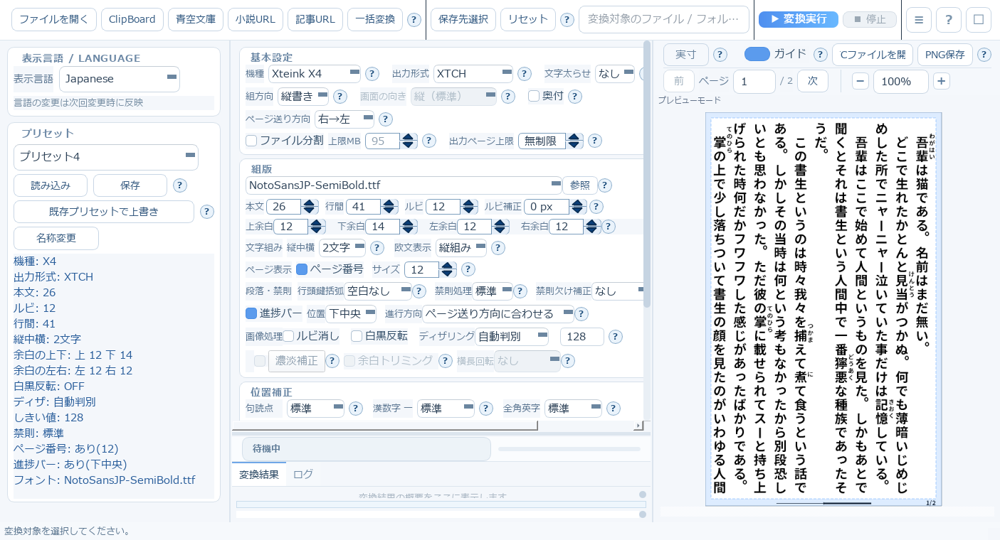
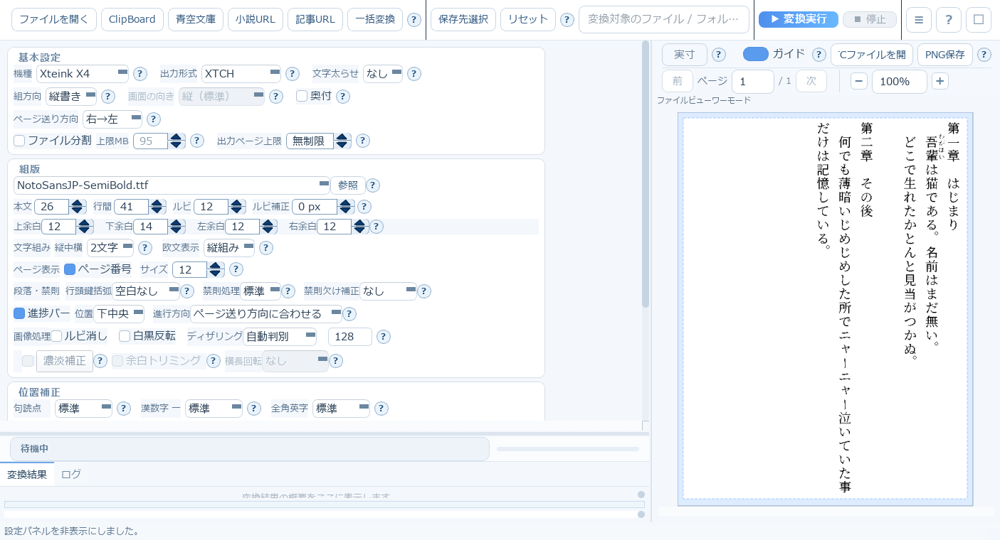
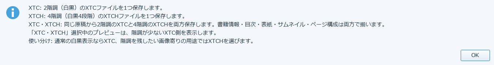

# 1. はじめに・画面の見方

## 基本の流れ

アプリが案内している基本の流れは次の5ステップです（画面左上の「使い方」アイコンでも確認できます）。

1. ファイルを開く
2. プリセットを選ぶ
3. 必要なら微調整
4. 変換実行
5. 右ペインで確認

画面は大きく3つに分かれています。

| 部分 | 役割 |
|---|---|
| 左：プリセットパネル | 保存済みの設定（プリセット）を選ぶ・保存する |
| 中央：組版設定 | 出力形式・フォント・余白・禁則処理などを1画面で調整する |
| 右：プレビュー | 変換後の見た目をページ単位で確認する |

上部のツールバーには、ファイルの取り込み口が並んでいます。

- **ファイルを開く** … EPUB / TXT / Markdown / PDF / 画像アーカイブなどをローカルから選ぶ
- **ClipBoard** … クリップボードのテキストをそのまま変換対象にする
- **青空文庫** … 作品を検索してダウンロード（[4章](04-aozora.md)）
- **小説URL** … なろう小説をダウンロード（[5章](09-narou-epub-helper.md)）
- **記事URL** … Webページの記事本文を取り込む（[3章](03-article-url.md)）
- **一括変換** … フォルダ単位でまとめて変換する（[6章](07-folder-batch.md)）

## 左パネルを閉じる

画面右上の三本線ボタン（≡）は、メニューではなく**左のプリセットパネルの開閉トグル**です。
中央の組版設定を広く使いたいときに押します。もう一度押すと元に戻ります。

## ヘルプの読み方

各設定項目の右にある `?` ボタンを押すと、その項目だけの説明がポップアップで表示されます。
迷ったときはまずここを確認してください。

次章では、中央の組版設定を一つずつ説明します。

→ [2. 基本設定（組版・出力形式）](02-basic-settings.md)
