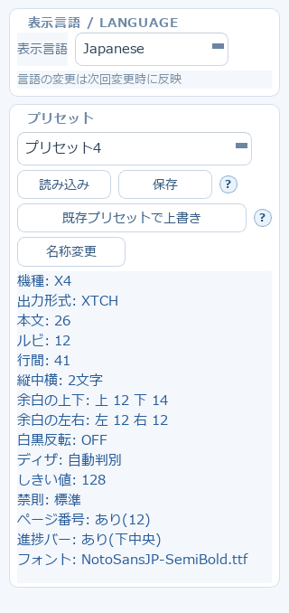
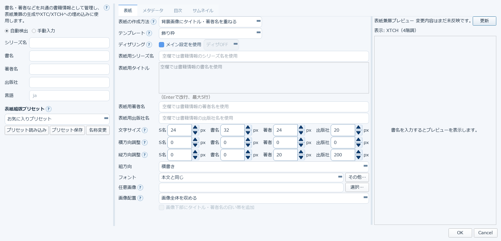

# 2. 基本設定（組版・出力形式）

中央の組版設定は、上から「基本設定」「組版」「位置補正」の3ブロックに分かれています。
ここでは特に迷いやすい項目を、アプリ内のヘルプ文言そのままに説明します。

## 基本設定ブロック

### 機種・出力形式

**機種**を選ぶと解像度が自動設定されます。手動で幅・高さを指定したいときは「Custom」を選びます。

出力形式は3通りです。

| 選択肢 | 内容 |
|---|---|
| **XTC** | 2階調（白黒）のXTCファイルを1つ保存 |
| **XTCH** | 4階調（白黒4段階）のXTCHファイルを1つ保存 |
| **XTC・XTCH** | 同じ原稿から両方を保存。書籍情報・目次・表紙・サムネイル・ページ構成は両方で揃う |

「XTC・XTCH」を選んでいるときのプレビューは、階調が少ないXTC側を表示します。
使い分けの目安は、通常の白黒表示ならXTC、階調を残したい画像寄りの用途ではXTCHです。

### 文字太らせ

二値化前に細い線を太らせる機能です。「なし」または1〜6を選べます。1が最も弱く、6が最も強い設定です。
旧バージョンの「弱」は2、「強」は6に相当します。白黒反転時は白文字が太ります。
挿絵や写真も一様に太る（暗部が広がる）点に注意してください。全入力ソースに適用されます。

### 組方向・画面の向き

縦書きが既定です。横書きを選ぶと本文が左上から右・下方向へ流れます。
横書きでは使わない位置補正ブロックを自動的に隠し、縦書きへ戻すと以前の設定値を保持したまま再表示します。

**画面の向き**は横書き専用の設定で、端末を倒す向きを選びます。「右に倒す」は端末の上端が右側へ、
「左に倒す」は端末の上端が左側へ来る持ち方です。「横」を選ぶとページを横長で組版し、回転して出力します。
横向きでは、余白の上下左右は端末を倒して読む状態での上下左右を指し、本文と一緒に回転します。

### 奥付

チェックすると、最終ページの後ろに変換日時・アプリバージョン・フォント・文字サイズ・余白などの
使用設定を横書きで印字した1ページを追加します。「この設定が良かったから同じ設定で変換したい」というときに、
出力ファイル自体から設定を確認できます。既定値から変更した組版オプションも一覧で印字します。

### ページ送り方向

PDF・画像・画像アーカイブ、およびそれらを含むフォルダ一括変換で使う設定です。
Studioは縦書き・横書き・漫画かどうかの判定を行わないため、縦書き書籍や一般的な日本の漫画は「右→左」、
横書き文書などは「左→右」を選んでください。TXT/EPUB/Markdownは組方向から自動的に決まります。

### ファイル分割・出力ページ上限

**ファイル分割**は、一部のカスタムOS環境で100MB前後のXTC/XTCHを開けない場合に使います。
チェックすると、指定MBを超える出力をページ単位で複数ファイルへ分割し、ファイル名には
`p001-p120` のようにページ範囲を付けます。

**出力ページ上限**は、指定したページ数で出力を打ち切ります。「無制限」なら全ページを出力します。
記事末尾の関連リンクや広告など、変換したくない終わりの数ページを落とす用途に使います。
プレビューでページ番号を確認してから指定してください。この値はプリセットには保存されません
（読み込んだだけで出力が短くなるのを防ぐため）。

## 組版ブロック

### フォント・文字サイズ

「参照…」からフォントファイルを選びます。本文・行間・ルビ・余白（上下左右）はここで数値指定します。

### 文字組み縦中横・欧文表示

**縦中横**は、半角数字を1文字分に横組みする上限の設定です。4文字なら4桁まで、3文字なら3桁まで、
2文字なら2桁までを縦中横にします。「無し」では縦中横にしません。

**欧文表示**の「縦組み」は従来どおり半角英字を縦方向に組みます。「横組み」は短い半角英字・英文句を
横書きrunとして扱い、縦書き本文内へ配置します。

### ページ番号・進捗バー

**ページ番号**をチェックすると各ページ右下に「現在ページ/総ページ」を表示します。サイズは1〜29の数値で、
30以上はエラーです。ページ番号ON時は、下余白を「サイズ+1」以上に自動確保します。

**進捗バー**をチェックすると下部に読書位置を示す黒い横棒を表示します。位置は下中央または下左。
進行方向の「ページ送り方向に合わせる」では縦書きが右→左、横書きが左→右になります。
PDF・画像は上で説明した「ページ送り方向」の指定に従うため、対象を選ぶまで実際の方向は確定しません。
「固定」を選ぶと組方向に関係なく常にその方向になります。進捗バーON時は、下余白を最低10px程度に自動確保します。

### 段落・禁則

**行頭鍵括弧**の「空白なし」は従来どおり行頭に「や『を置きます。「1文字下げ」は岩波文庫のように、
行頭鍵括弧の前へ1文字分の空きを入れます。

**禁則処理**は3段階です。

- **オフ**: 禁則処理を行わず機械的に流し込む
- **簡易**: 行頭禁則・行末禁則・句読点のぶら下げのみ
- **標準**: 連続約物や閉じ括弧＋句読点のまとまりも含めた、現行の禁則処理

## Markdown専用設定（横書き）

横書きでMarkdownファイルを選んだときだけ表示されます。H1などの章見出し直前で改ページし、
`---` を罫線または改ページとして扱い、パイプ表を列揃えで描画できます。

- **見出しサイズ階層**: H1/H2/H3を本文より大きくする
- **ネスト字下げ**: Markdownリストの先頭空白による階層を保持する
- **表罫線**: 「横罫線のみ」は行の区切り線だけ、「全罫線」は縦線も含めた格子状の罫線

## 画像処理

**濃淡補正**（スキャンPDF/画像の薄い文字や黄ばんだ背景の補正）については
[10章 スキャンPDF・画像の下ごしらえ](10-image-correction.md) で詳しく説明します。

**余白トリミング**は、紙原稿は余白が大きく、そのまま縮小すると本文が小さくなりすぎる問題への対策です。
ページごとにインク領域を検出して余白を切ってから縮小することで、実効文字サイズを引き上げます。
白紙ページなどインク領域を検出できないページは、そのまま変換します。

**横長回転**は、横長（幅＞高さ）のページだけを90度回転し、縦画面いっぱいに表示します。
「右に倒す」「左に倒す」は端末を倒して読むときの持ち方で、縦長・正方形のページはそのまま変換します。

## 位置補正ブロック

波線系記号（〜／〰／~など）の描画方式と縦位置を調整します。

- **対象（描画方式）**: 「回転グリフ」はフォントの質感を保って90度回転、「別描画」はアプリ側で縦波線を描く、
  「自動フォールバック」は回転グリフに失敗した場合だけ別描画へ切り替える
- **対象（縦位置）**: 「標準」からの下補正1〜6。数値が大きいほど補正が強くなる（2は従来の弱、4は従来の強と同じ）

## プリセット

現在の組版設定をひとまとめにして保存・呼び出しできます。「既存プリセットで上書き」は、
プリセット一覧から既存プリセットを選び、現在の組版設定で上書き保存します。

## 書籍情報・表紙兼扉ダイアログ

書名・著者名などの書誌情報と、表紙兼扉の作り方をまとめて設定します。

- **表紙の作成方法**: 背景画像にタイトル・著者名を重ねる、など
- **テンプレート**・**ディザリング**: 表紙のデザインと階調表現を選ぶ
- **表紙用シリーズ名・タイトル・著者名・出版社名**: 空欄なら書籍情報側の値を使う
- **文字サイズ／横方向調整／縦方向調整**: 表紙の各要素ごとに個別調整できる
- 右側のプレビューで、書名を入力すると表紙の見た目を確認できます

→ 次は変換元の取り込み方法です。[3. Web記事を取り込む（記事URL）](03-article-url.md)
