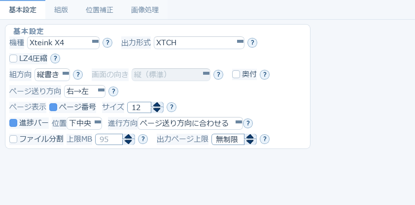
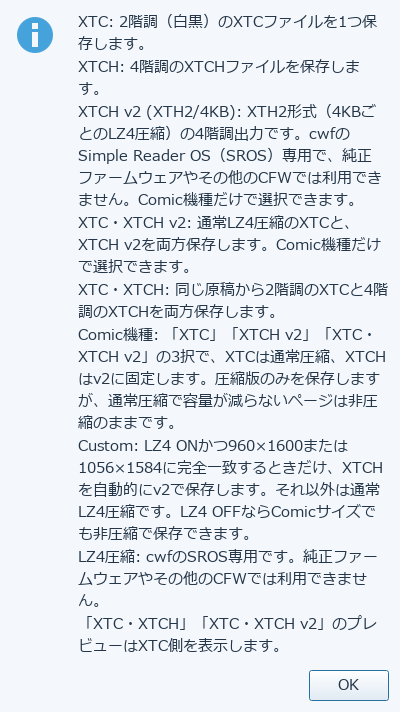

# 2. 基本設定タブ

中央の設定エリアは「基本設定」「組版」「位置補正」「画像処理」の4つのタブに分かれています
（→ [設定エリアの4つのタブ](../README.md#設定エリアの4つのタブ)）。
この章では最初の **基本設定** タブを説明します。

出力するファイルの形式や、ページ番号・進捗バーなど、原稿全体の扱いを決める項目が並びます。

## 機種・出力形式

**機種**を選ぶと解像度が自動設定されます。手動で幅・高さを指定したいときは「Custom」を選びます。

出力形式は5通りです。

| 選択肢 | 内容 |
|---|---|
| **XTC** | 2階調（白黒）のXTCファイルを1つ保存 |
| **XTCH** | 4階調（白黒4段階）のXTCHファイルを1つ保存 |
| **XTCH v2 (XTH2/4KB)** | 4階調のXTCHを、**XTCH v2 形式**で1つ保存（下記） |
| **XTC・XTCH v2** | 同じ原稿から XTC と XTCH v2 の両方を保存 |
| **XTC・XTCH** | 同じ原稿から XTC と XTCH の両方を保存。書籍情報・目次・表紙・サムネイル・ページ構成は両方で揃う |

「XTC・XTCH」を選んでいるときのプレビューは、階調が少ないXTC側を表示します。
使い分けの目安は、**通常の白黒表示ならXTC、階調を残したい画像寄りの用途ではXTCH**です。

### XTCH v2 について

XTCH v2 は、4階調のページ画像を **XTH2** という形式で収めたXTCHです。
ページ画像のビットの並びを行方向へ並べ替え、**4KB以下の独立したLZ4のかたまり（セグメント）**に分けて圧縮します。
ファイルの見出しには、形式の版として major=2・minor=0（ファイル上のバイト列は `02 00`）が入ります。

- **XTCH v2 を表示できるかどうかは、端末のファームウェアやビューアによります。**
  お使いの環境が対応しているか分からないときは、従来の **XTCH** を選んでください。
  従来の XTCH・XTC は、これまでどおり選べます
- 変換に失敗したり途中で停止したりしたときは、途中までのファイルを残さず、変換前にあったファイルを元に戻します
- フォルダ一括変換（[12章](12-folder-batch.md)）でも選べます。できた XTCH v2 ファイルは、
  右ペインの［XTCファイルを開く］や XTCツール（[14章](14-xtc-tools.md)）で開いて確認できます

## 組方向・画面の向き

**組方向**は縦書きが既定です。横書きを選ぶと本文が左上から右・下方向へ流れます。
横書きでは使わない位置補正の項目を自動的に隠し、縦書きへ戻すと以前の設定値を保持したまま再表示します。

**画面の向き**は横書き専用の設定で、端末を倒す向きを選びます。「右に倒す」は端末の上端が右側へ、
「左に倒す」は端末の上端が左側へ来る持ち方です。「横」を選ぶとページを横長で組版し、回転して出力します。
横向きでは、余白の上下左右は端末を倒して読む状態での上下左右を指し、本文と一緒に回転します。

> PDF・画像・画像アーカイブは組版を行わないため、組方向は選択中無効になります。

組方向・画面の向き・Markdownレイアウトの設定は、アプリを終了するときに保存され、**次回の起動時に前回の状態へ戻ります**。

## 奥付

チェックすると、最終ページの後ろに変換日時・アプリバージョン・フォント・文字サイズ・余白などの
使用設定を横書きで印字した1ページを追加します。

「この設定が良かったから同じ設定で変換したい」というときに、出力ファイル自体から設定を確認できます。
既定値から変更した組版オプションも一覧で印字します。

## ページ送り方向

PDF・画像・画像アーカイブ、およびそれらを含むフォルダ一括変換で使う設定です。

> Studioは**PDFや画像の縦書き・横書き・漫画判定を行いません**。
> 縦書き書籍や一般的な日本の漫画は「右→左」、横書き文書などは「左→右」を選んでください。

TXT/EPUB/Markdownは組方向から自動的に決まります。この指定は、進捗バーの進行方向が
「ページ送り方向に合わせる」のときにも使われます。

## ページ表示

- **ページ番号** … チェックすると各ページ右下に「現在ページ/総ページ」を表示します。
  サイズは1〜29の数値で、30以上はエラーです
- ページ番号ON時は、**下余白を「サイズ+1」以上に自動確保**します

## 進捗バー

チェックすると下部に読書位置を示す黒い横棒を表示します。

- **位置** … 下中央または下左
- **進行方向** … 「ページ送り方向に合わせる」では縦書きが右→左、横書きが左→右になります。
  PDF・画像は[ページ送り方向](#ページ送り方向)の設定に従うため、
  対象を選ぶまで実際の方向は確定しません。「固定」を選ぶと組方向に関係なく常にその方向になります
- 進捗バーON時は、**下余白を最低10px程度に自動確保**します

## ファイル分割

一部のカスタムOS環境で100MB前後のXTC/XTCHを開けない場合に使います。
チェックすると、指定MB（上限MB）を超える出力をページ単位で複数のXTC/XTCHへ分割します。
ファイル名には `p001-p120` のようにページ範囲を付けます。

分割するときは、**できるだけ章の境目で区切り**、分けたそれぞれのファイルの目次と章のページ番号を作り直します。

> **XTC/XTCHは1ファイル最大65,535ページです。** これを超える場合は、
> ファイル分割がOFFでも自動的に分割します。このときはページ数だけを理由に分けるので、
> 選んでいない容量上限（既定の95MB）は使いません。

## 出力ページ上限

指定したページ数で出力を打ち切ります。「無制限」なら全ページを出力します。
記事末尾の関連リンクや広告など、変換したくない終わりの数ページを落とす用途に使います。
プレビューでページ番号を確認してから指定してください。

> この値は**プリセットには保存されません**（読み込んだだけで出力が短くなるのを防ぐため）。

> 「文字太らせ」は [画像処理タブ](13-image-correction.md#文字太らせ)、
> 「Markdownレイアウト」は [組版タブ](03-typesetting.md#markdownレイアウト横書き) にあります。

→ [3. 組版タブ](03-typesetting.md)
