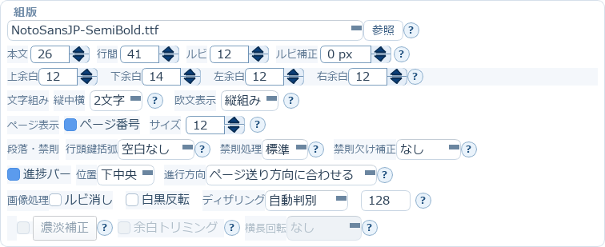

# 3. 組版ブロック

本文の見た目を決める、いちばん出番の多いブロックです。

## フォント・サイズ・余白

- **フォント** … 「参照…」からフォントファイルを選びます
- **本文／行間／ルビ** … それぞれの文字サイズと行送りを数値で指定します
- **ルビ補正** … フォントによるルビの見た目の位置を調整します
- **上余白／下余白／左余白／右余白** … ページの四辺の余白（px）

## 文字組み

**縦中横**は、半角数字を1文字分に横組みする上限の設定です。

| 設定 | 動作 |
|---|---|
| 4文字 | 4桁までを縦中横にする |
| 3文字 | 3桁までを縦中横にする |
| 2文字 | 2桁までを縦中横にする |
| 無し | 半角数字を縦中横にしない |

**欧文表示**は2通りです。

- **縦組み** … 従来どおり半角英字を縦方向に組みます
- **横組み** … 短い半角英字・英文句を横書きrunとして扱い、縦書き本文内へ配置します

## ページ表示

- **ページ番号** … チェックすると各ページ右下に「現在ページ/総ページ」を表示します。
  サイズは1〜29の数値で、30以上はエラーです
- ページ番号ON時は、**下余白を「サイズ+1」以上に自動確保**します

## 段落・禁則

**行頭鍵括弧**

- **空白なし** … 従来どおり行頭に「や『を置きます
- **1文字下げ** … 岩波文庫のように行頭鍵括弧の前へ1文字分の空きを入れます

**禁則処理**は3段階です。

| 設定 | 動作 |
|---|---|
| オフ | 禁則処理を行わず機械的に流し込む |
| 簡易 | 行頭禁則・行末禁則・句読点のぶら下げのみ |
| 標準 | 連続約物や閉じ括弧＋句読点のまとまりも含めた、現行の禁則処理 |

**禁則欠け補正**は、禁則処理によって行末が1〜2文字分短くなった行の字間を微調整して埋める機能です。

> **縦書きのみ**に対応しています。横書きでは設定しても補正は行われません。
> 対象は本文段落の行だけで、見出し・箇条書き・引用・注記は対象外です。
> 補正対象の行が1行もない場合は、ログに「禁則欠け補正：対象行なし」と出ます。

## 進捗バー

チェックすると下部に読書位置を示す黒い横棒を表示します。

- **位置** … 下中央または下左
- **進行方向** … 「ページ送り方向に合わせる」では縦書きが右→左、横書きが左→右になります。
  PDF・画像は[基本設定](02-basic-settings.md#ページ送り方向)の「ページ送り方向」に従うため、
  対象を選ぶまで実際の方向は確定しません。「固定」を選ぶと組方向に関係なく常にその方向になります
- 進捗バーON時は、**下余白を最低10px程度に自動確保**します

## 画像処理

- **ルビ消し** … ルビを描画しません
- **白黒反転** … 白地黒文字と黒地白文字を入れ替えます
- **ディザリング／しきい値** … 階調表現の方式と、白黒に分ける明るさの境目
- **濃淡補正** … スキャンPDF/画像の薄い文字や黄ばんだ背景を補正します
  （→ [13章](13-image-correction.md)）
- **余白トリミング** … 紙原稿は余白が大きく、そのまま縮小すると本文が小さくなりすぎます。
  ページごとにインク領域を検出して余白を切ってから縮小することで、実効文字サイズを引き上げます。
  白紙ページなどインク領域を検出できないページは、そのまま変換します
- **横長回転** … 横長（幅＞高さ）のページだけを90度回転し、縦画面いっぱいに表示します。
  「右に倒す」「左に倒す」は端末を倒して読むときの持ち方です。縦長・正方形のページはそのまま変換します

## Markdown専用設定（横書き）

横書きでMarkdownファイルを選んだときだけ表示されます。
H1などの章見出し直前で改ページし、`---` を罫線または改ページとして扱い、
パイプ表を列揃えで描画できます。

- **見出しサイズ階層** … H1/H2/H3を本文より大きくします
- **ネスト字下げ** … Markdownリストの先頭空白による階層を保持します
- **表罫線** … 「横罫線のみ」は行の区切り線だけ、「全罫線」は縦線も含めた格子状の罫線

→ [4. 位置補正ブロック](04-position.md)
