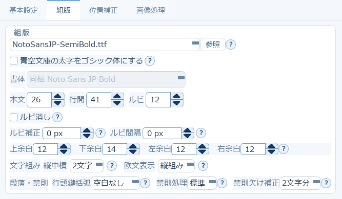

# 3. 組版タブ

本文の見た目を決める、いちばん出番の多いタブです。

## フォント・サイズ・余白

- **フォント** … 一覧から選ぶか、「参照」でフォントファイルを追加します。
  追加したフォントはアプリのfontフォルダへコピーされます（TTF・TTC・OTF・OTC）。
  同名のフォントが既にある場合は上書きせず、登録済みのものを選びます
- **本文／行間／ルビ** … それぞれの文字サイズと行送りを数値で指定します
- **ルビ補正** … ルビを**本文の流れに沿って**動かします（縦書きでは上下、横書きでは左右）。
  正の値で流れの先頭側（縦書きで上、横書きで左）へ、負の値でその逆へ動きます
- **ルビ間隔** … ルビと**本文の間隔**を変えます（縦書きでは左右、横書きでは上下）。
  正の値で本文から離し、負の値で近づけます
- **上余白／下余白／左余白／右余白** … ページの四辺の余白（px）

> ルビ補正・ルビ間隔はどちらも −16〜+16px、0pxが従来どおりです。
> 本文の位置・折り返し・ルビの割付・ルビサイズは変わりません。
> ページの端では、実際に動く量が制限されることがあります。

### 青空文庫の太字をゴシック体にする

青空文庫の「太字」注記で指定された本文だけを、ゴシック体で描きます。

- **チェックなし（既定）** … いまの書体に疑似太字を重ねます
- **チェックあり** … 同梱の Noto Sans JP Bold で描きます。
  右の「書体」で、fontフォルダに登録済みの別のフォント（TTCのface）も選べます

> Markdown・一般のEPUBの太字、画像・PDFには効きません。
> 書体を変えると、改行位置やページ数が変わることがあります。
> 本文と同じ書体ファミリーで太さの差が小さい場合（例：本文が Noto Sans JP SemiBold）は、
> 強調が見えるよう疑似太字を重ねます。

## 文字組み

**縦中横**は、半角数字を1文字分に横組みする上限の設定です。

| 設定 | 動作 |
|---|---|
| 4文字 | 4桁までを縦中横にする |
| 3文字 | 3桁までを縦中横にする |
| 2文字 | 2桁までを縦中横にする |
| 無し | 半角数字を縦中横にしない |

**欧文表示**は2通りです。

- **縦組み** … 従来どおり半角英字を縦方向に組みます
- **横組み** … 短い半角英字・英文句を横書きrunとして扱い、縦書き本文内へ配置します

## 段落・禁則

**行頭鍵括弧**

- **空白なし** … 従来どおり行頭に「や『を置きます
- **1文字下げ** … 岩波文庫のように行頭鍵括弧の前へ1文字分の空きを入れます

本文の字送りは原則として**ベタ組**（字間を空けない）です。句点・読点と閉じ括弧、連続する閉じ括弧の間は詰め、
感嘆符・疑問符のあと（閉じ括弧の直前を除く）には1字分の空きを入れます。

**禁則処理**は3段階です。

| 設定 | 動作 |
|---|---|
| オフ | 禁則処理を行わず機械的に流し込む |
| 簡易 | 行頭禁則・行末禁則・句読点のぶら下げのみ |
| 標準 | 連続約物や閉じ括弧＋句読点のまとまりも含めた、現行の禁則処理 |

**禁則欠け補正**は、禁則処理によって行末が1〜2文字分短くなった行の字間を微調整して埋める機能です。
「なし」「1文字分」「2文字分」から選び、**既定は「2文字分」**です。
字間を広げるときも、開き括弧の直後・閉じ括弧の直前・連続する約物の間は広げません。

> **縦書きのみ**に対応しています。横書きでは設定しても補正は行われません。
> 対象は本文段落の行だけで、見出し・箇条書き・引用・注記は対象外です。
> 補正対象の行が1行もない場合は、ログに「禁則欠け補正：対象行なし」と出ます。

## ルビ消し

チェックすると、ルビを描画しません。本文の組み方の設定なので、画像処理タブではなくこのタブにあります。

## Markdownレイアウト（横書き）

横書きでMarkdownファイルを選んだときだけ設定欄が表示されます。
縦書きのときは「Markdownレイアウトの7設定は横書き専用です」という案内が代わりに出ます。

| 項目 | 選択肢 | 内容 |
|---|---|---|
| **章改ページ** | なし／H1／H1〜H2／H1〜H3 | 指定した見出しの直前で改ページする |
| **水平線** | 空行／罫線／改ページ | `---` をどう扱うか |
| **表** | テキスト／罫線表 | パイプ表を文字のまま流すか、列をそろえた表として描くか |
| **表罫線** | 横罫のみ／全罫線 | 罫線表の線の引き方。「横罫のみ」は行の区切り線だけ、「全罫線」は縦線も含めた格子 |
| **見出しサイズ階層** | チェック | H1/H2/H3を本文より大きくする |
| **H1サイズ（%）** | 100〜250% | 見出しサイズ階層のときのH1の大きさ。H2/H3はそこから段階的に小さくなる。170%が従来どおり |
| **リストのネスト字下げ** | チェック | リストの先頭空白による階層（字下げ）を残す |

> ページ番号・進捗バーは [基本設定タブ](02-basic-settings.md#ページ表示)、
> 白黒反転・ディザリングなどの画像の項目は [画像処理タブ](13-image-correction.md) にあります。

→ [4. 位置補正タブ](04-position.md)
