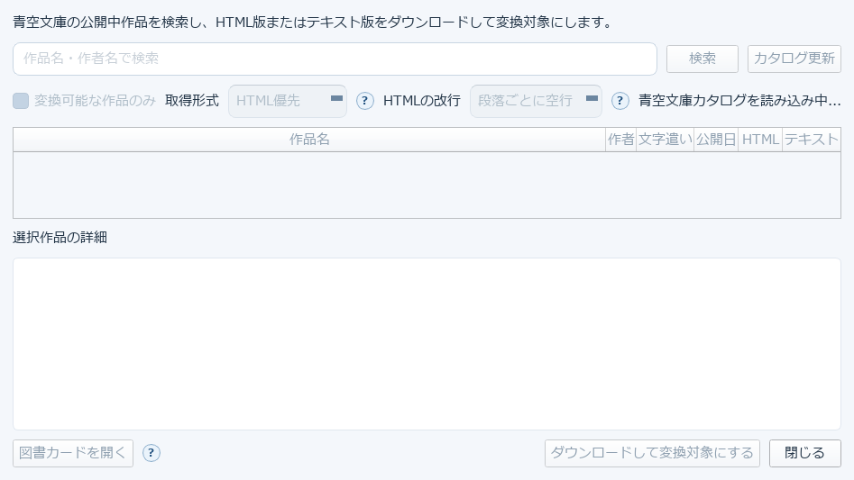

# 4. 青空文庫の作品を取り込む

上部ツールバーの「青空文庫」から、青空文庫の公開中作品を検索し、HTML版またはテキスト版を
ダウンロードして変換対象にできます。

## 使い方

1. 「作品名・作者名で検索」欄にキーワードを入れて検索する（初回はカタログの読み込みに少し時間がかかります）
2. 一覧から作品を選ぶと、下の「選択作品の詳細」に情報が表示されます
3. **取得形式**（HTML優先など）と**HTMLの改行**（段落ごとに空行、など）を必要に応じて調整します
4. 「変換可能な作品のみ」にチェックすると、対応していない形式の作品を一覧から除外できます
5. 「ダウンロードして変換対象にする」を押すと、メイン画面の変換対象として設定されます

「図書カードを開く」で、選択中の作品の青空文庫サイト上のページを確認できます。

## 補足

- ルビ・傍点・字下げなど、青空文庫記法のほとんどはそのまま反映されます
- ダウンロード結果はキャッシュされるため、同じ作品を何度も選び直しても再ダウンロードは発生しません
- 章立て（目次）は、青空文庫の見出し記法（大見出し・中見出し・小見出しなど）から自動的に検出されます

→ [5. なろう小説をEPUB化する](09-narou-epub-helper.md)
