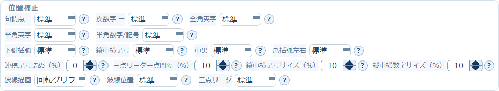

# 4. 位置補正ブロック

縦書きでは、記号や英数字の見え方がフォントによって微妙に変わります。
このブロックは、そうした**文字種ごとの位置の微調整**をまとめたものです。

> このブロックは**縦書き専用**です。組方向を「横書き」にすると自動的に隠れ、
> 縦書きへ戻すと以前の設定値を保持したまま再表示されます。

## 文字種ごとの位置

次の項目は、いずれも「標準」からの位置ずらしを段階で指定します。
フォントを変えたときに文字が上下・左右へ寄って見える場合に調整します。

| 項目 | 対象 |
|---|---|
| 句読点 | 、 。（**ぶら下がりになったものだけ**） |
| 漢数字 ー | 漢数字と組み合わせた長音符 |
| 全角英字 | Ａ Ｂ Ｃ … |
| 半角英字 | A B C … |
| 半角数字/記号 | 1 2 3 / ! ? … |
| 下鍵括弧 | 」 』 |
| 縦中横記号 | 縦中横の中で使われる記号 |
| 中黒 | ・ |
| 爪括弧左右 | 〝 〟 と引用符 " " ' ' の左右位置 |

**爪括弧左右**だけは左右方向の調整で、設定は1つです。
**開きを右へ寄せると、閉じは同じだけ左へ寄ります。**

> **句読点の対象範囲**
> 「句読点」の位置補正が効くのは、禁則処理によって**行末にぶら下がった句読点だけ**です。
> 行の途中にある句読点は、補正を指定しても標準の位置のまま描かれます。
> ぶら下がりが起きるかどうかは「組版」ブロックの禁則処理の設定によります。

## 連続記号詰め（%）

ダッシュ（――）、くの字点（／＼）、中黒（・）など、**連続する記号の見た目の字間だけ**を詰めます。
0%は従来どおりで、値を上げると記号同士が近づきます。

> **行送り・折り返し・禁則処理は変更しません。** 見た目の字間だけの調整です。

> **三点リーダー（……）と二点リーダー（‥‥）はこの設定の対象外です。**
> これらはフォントではなくアプリ本体が点を描いており、点がセルをまたいでも等間隔に見える
> 詰め量が書体によらず一つに決まります。そのため、設定を上げなくても常に正しい間隔で描かれます。
> （v3.1.2.9 で変更。それ以前は三点リーダーもこの%指定に従っていました）

## 縦中横記号サイズ（%）

縦中横で描く記号ペアの見た目の倍率です。100が従来どおりです。

## 波線描画・波線位置

波線系記号（〜 / 〰 / ~ など）の扱いです。

**波線描画**（描き方）

| 設定 | 動作 |
|---|---|
| 回転グリフ | フォントの質感を保って90度回転する |
| 別描画 | アプリ側で縦波線を描く |
| 自動フォールバック | 回転グリフに失敗した場合だけ別描画へ切り替える |

**波線位置**（縦位置）

「標準」からの下補正1〜6で指定します。数値が大きいほど補正が強くなります
（2は従来の「弱」、4は従来の「強」と同じです）。

## 三点リーダ

三点リーダの点列の縦位置を調整します。「標準」から上下に補正できます。

> 三点リーダの標準位置はもともとセルの下寄りのため、**下方向の補正はほとんど動きません**。
> 上方向は全段階が有効です。

→ [5. 変換を実行して結果を確認する](05-convert-and-check.md)
