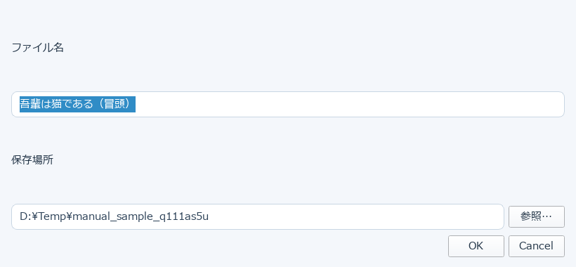
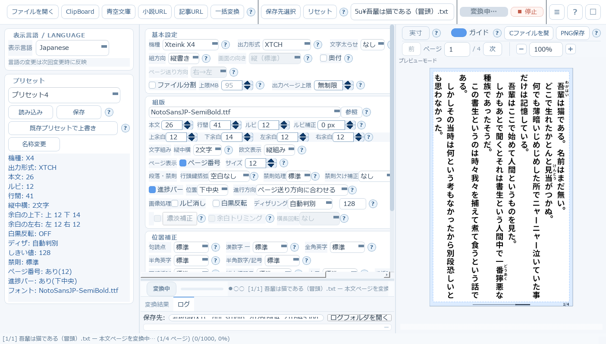
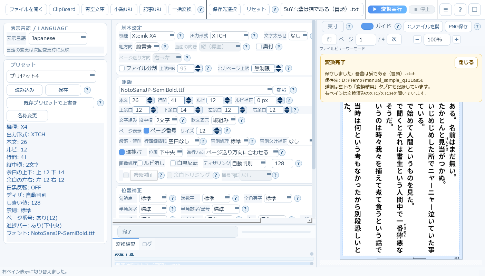
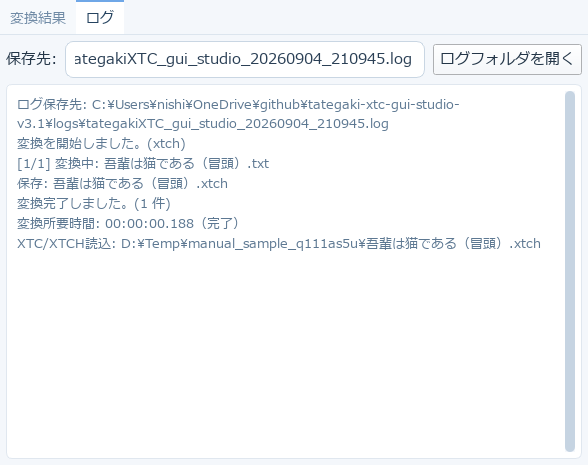

# 5. 変換を実行して結果を確認する

設定が決まったら、画面右上の **［変換実行］** を押します。この章では、押したあと何が起こるかを順に説明します。

## 5-1. 出力設定の確認

変換実行を押すと、まず出力先の確認ダイアログが開きます。

- **ファイル名**: 変換元のファイル名から自動的に候補が入ります。変更できます（拡張子は出力形式に応じて自動で付きます）
- **保存場所**: 保存先フォルダです。［参照…］で変更できます

ここで指定した保存場所は、**その回の変換だけ**に使われます。毎回同じ場所に保存したい場合は、
上部ツールバーの［保存先選択］で既定の保存先を決めておくと、ここに最初から入った状態になります
（解除は［リセット］）。

## 5-2. 変換中

変換が始まると、画面下部に進捗バーと状態表示が出ます。

- 進捗バーの左のラベルに「変換中」「完了」などの状態が出ます
- 複数ファイルを変換しているときは `[2/5]` のように何件目かが表示されます
- 途中でやめたいときは、右上の **［停止］** を押します

## 5-3. 変換完了

完了すると、右ペインの上に完了通知が出て、変換したファイルが右ペインで自動的に開きます。

通知には保存したファイル名・保存先・次にできることが書かれています。［閉じる］で消せます。

## 5-4. 「変換結果」タブ

画面下部の **変換結果** タブに、その回の結果がまとまります。

- 上部に **保存 / 自動連番 / 上書き** の件数が出ます
  - *自動連番* … 同名ファイルがあったため `_2` のように名前を変えて保存した件数
  - *上書き* … 既存ファイルを上書きした件数
- **［保存先を開く］** … 出力フォルダをエクスプローラーで開きます
- **［右ペインで確認］** … 一覧で選んだファイルを右ペインのビューワーで開きます
  （一覧のファイルを**ダブルクリック**しても同じです）

複数ファイルを変換したときは、一覧から1つ選んで中身を確かめる、という使い方になります。

## 5-5. 「ログ」タブ

**ログ** タブには、変換の経過が時系列で残ります。

うまくいかないときは、まずここを見てください。どのファイルで止まったか、どんな理由かが分かります。

- **保存先** … ログファイルの実体の場所です。［ログフォルダを開く］で開けます
- 不具合を報告するときは、このログの内容を添えていただけると原因の特定が早くなります

→ 次は、右ペインのプレビューの使い方です。[6. プレビュー（右ペイン）](06-preview.md)
