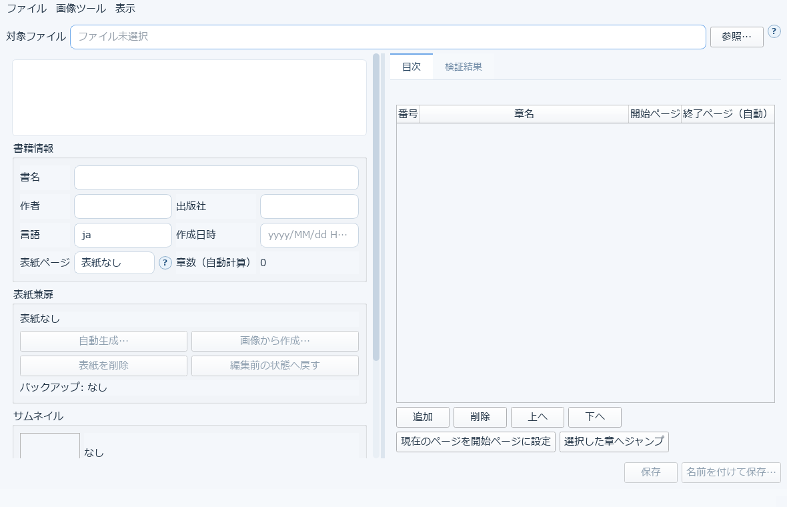

# 8. XTCツールで確認・編集する

すでに作成したXTC/XTCH/XTG/XTHファイルを開いて、書籍情報の修正や表紙の差し替え、
目次の編集、ファイルの整合性検証ができるツールです。メイン画面から独立したウィンドウで開きます。

対象ファイルは、欄へドラッグ＆ドロップするか「参照…」から選びます。

## ファイルを読み込むと

ファイルサイズ・ページ数・バージョン・読み方向などの基本情報と、書籍情報、表紙兼扉、サムネイルが
読み込まれます。

- **書籍情報**: 書名・作者・出版社・言語・作成日時を直接編集できます
- **表紙ページ**: 表紙として使うページを指定します
- **表紙兼扉**: 「自動生成…」「画像から作成…」「表紙を削除」「編集前の状態へ戻す」から選べます。
  編集前の状態は自動的にバックアップされます
- **サムネイル**: 埋め込まれているサムネイル画像を確認できます

## 目次タブ

章の一覧を、番号・章名・開始ページ・終了ページ（自動計算）の表で確認・編集できます。

- **追加・削除・上へ・下へ**: 章の追加や並び替え
- **現在のページを開始ページに設定**: プレビュー中のページを、選択中の章の開始ページにする
- **選択した章へジャンプ**: 選択した章の先頭ページへプレビューを移動する

TXT/Markdownからの変換では、見出し（Markdownの`#`など）から章立てが自動的に作られます。
青空文庫作品では、青空文庫の見出し記法から自動検出されます。

## 検証結果タブ

保存すると、保存後に行った自己検証の結果（章数・ページ範囲・ページデータが壊れていないか等の
確認結果）がここに表示されます。保存前は案内文だけが表示されます。

「完全検証を実行」でいつでも手動検証でき、「検証結果をクリップボードへコピー」で結果をコピーできます。

## 保存

「保存」は元のファイルを上書きします。「名前を付けて保存…」は別ファイルとして保存します。
表紙編集前バックアップの上に保存しようとすると、複製してから編集するか確認されます
（バックアップ自体を上書きすることはできません）。

→ [9. 大きなEPUBを巻分割する](06-epub-split.md)
