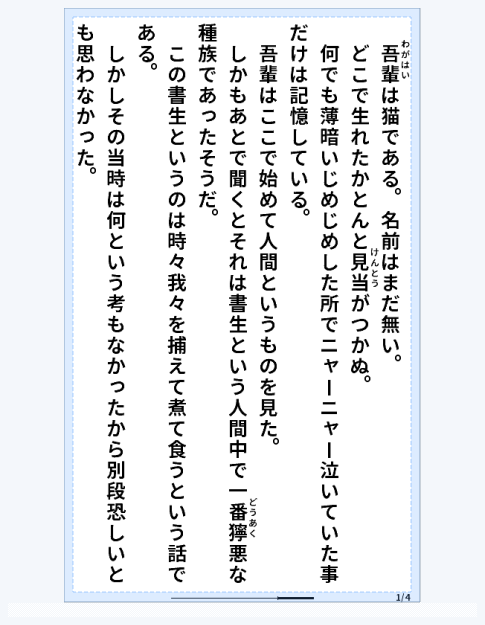

# 6. プレビュー（右ペイン）

右ペインは、変換結果がどう見えるかを確かめる場所です。**設定を変えたら、まずここで確認する**のが
基本の使い方になります。

上の例では、縦書き本文にルビ（吾輩=わがはい、見当=けんとう、獰悪=どうあく）が振られ、
右下にページ番号、下部に進捗バーが表示されています。

## 2つのモード

右ペインの下に、いま何を表示しているかが出ます。

| 表示 | 意味 |
|---|---|
| **プレビューモード** | 現在の設定で組版した結果を、その場で描いて見せている状態 |
| **ファイルビューワーモード** | 変換済みのXTC/XTCHファイルを直接開いて表示している状態 |

変換が完了すると自動的にファイルビューワーモードに切り替わり、**実際に出来上がったファイル**が
表示されます。ファイルビューワーモードでは、表示しているのが完成品そのものなので、
プレビューの更新は不要です。

> 他のツールでLZ4圧縮したXTC/XTCH（Simple Reader OS系の圧縮ページ）も表示できます。
> このときは「ファイルビューワーモード（圧縮ファイル）」と表示されます。

## ページを移動する

- **［前］／［次］** … 1ページずつ移動します
- **ページ欄** … 数字を直接入れて移動できます。右側に `/ 総ページ数` が出ます。
  表示範囲を指定しているときも、元の文書でのページ番号（絶対ページ番号）で表示します

## 表示倍率

- **［−］／［＋］** と倍率欄（既定100%）で拡大・縮小します

## 実寸

PC画面上の表示サイズを、選択中の機種の実物サイズに近づける表示モードです。
端末に表示したときのおおよその大きさを確認したい場合に使います。

ONにすると右ペインの倍率欄は「実寸補正」に切り替わります。表示が実物より大きい／小さい場合は、
この実寸補正を調整してください。OFFでは右ペイン倍率は通常の表示ズームとして働きます。

## ガイド

右ペインのプレビューに、余白や非描画域の目安線を重ねて表示します。
本文が端に寄りすぎていないか、余白設定が意図通りかを確認するときに使います。

ONにすると補助線を表示し、OFFにすると実際の見た目に近い状態で確認できます。
**変換結果そのものを書き換える機能ではなく、確認用の表示補助です。**

## そのほかのボタン

- **［XTCファイルを開く］** … 手元のXTC/XTCHファイルを直接開いて中身を確認できます
- **［PNG保存］** … 表示中のページをPNG画像として書き出します

## プレビューの表示範囲と更新

設定欄の下に、プレビューの操作行があります。

- **反映方式** … 設定を変えたときの反映のしかたです
  - **自動**（既定） … 表示範囲が20ページ以下なら、設定を変えるたびに作り直します。
    21ページ以上のときは自動では作り直さず、「プレビュー更新が必要です」と表示します
  - **手動** … 設定を変えても作り直さず、［プレビュー更新］を押したときに作り直します
- **プレビュー 開始 ～ 終了** … プレビューするページの範囲です。
  開始・終了とも1〜65,535ページを指定でき、既定は1〜20ページです。
  長い原稿の後半だけを確かめたいときに、後ろのページを直接指定できます
- **［プレビュー更新］** … いまの設定を右ペインへ反映します。変換ファイルは保存しません。
  保存するときは［変換実行］を押してください

> ファイルを開いた直後の最初のプレビューは、反映方式に関係なく自動で作ります。
> 1,001ページ以上を手動で生成するときは確認が出ます。範囲を広げるほど、読み込み・再描画・
> メモリの使用量が増えます。

> ページ番号と進捗バーは、範囲を指定したときも**文書全体での位置**で描きます
> （全5ページの2〜3ページ目だけを表示しても「2/5」「3/5」になります）。

元ファイルをエディタで直したときは、ツールバーの **［読み直し］（F5）** で
ファイルを選び直さずにプレビューを作り直せます（→ [1章](01-getting-started.md#元ファイルを直しながら確認する)）。

→ 次は、設定をまとめて保存できるプリセットです。[7. プリセット](07-presets.md)
