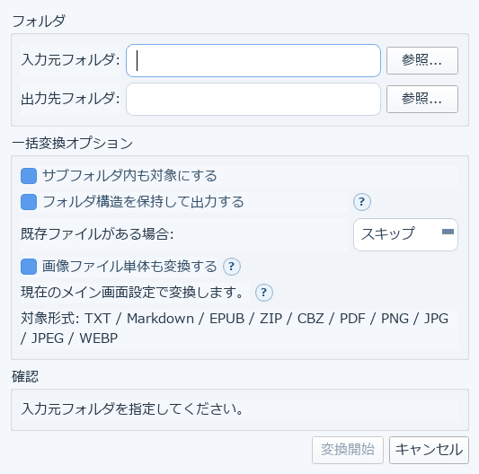

# 6. フォルダをまとめて変換する（一括変換）

上部ツールバーの「一括変換」から、フォルダ内の複数ファイルをまとめて変換できます。

## 重要: 設定はメイン画面から引き継がれます

フォルダ一括変換は、メイン画面で現在選択中のフォント・余白・画像処理などの組版設定を
**そのまま全ファイルへ適用**します。実行前に、メイン画面側の設定を確認しておいてください。

## 使い方

1. **入力元フォルダ**と**出力先フォルダ**を指定します
2. 一括変換オプションを必要に応じて設定します
   - **サブフォルダ内も対象にする**: チェックすると入力元フォルダのサブフォルダ構造を出力先にも再現します
   - **フォルダ構造を保持して出力する**
   - **既存ファイルがある場合**: スキップ／上書きなどを選べます
   - **画像ファイル単体も変換する**: フォルダ内に単独で置かれたPNG/JPG/JPEG/WEBPを、
     1枚ずつ独立したXTC/XTCHへ変換します
3. 対象形式は TXT / Markdown / EPUB / ZIP / CBZ / PDF / PNG / JPG / JPEG / WEBP です
4. 下の「確認」欄で内容を確かめてから「変換開始」を押します

途中で見つかった問題（対応ソフトの不足など）は、開始前にまとめて警告されます。

→ [7. スキャンPDF・画像の下ごしらえ（濃淡補正）](10-image-correction.md)
