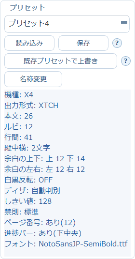

# 7. プリセット（設定の保存と呼び出し）

組版設定は項目が多いので、気に入った組み合わせが決まったら **プリセット** として保存しておきます。
次からは選ぶだけで同じ設定に戻せます。



プリセットパネルは画面の左端にあります。三本線ボタン（≡）で開閉できます（[1章](01-getting-started.md)参照）。

## 使い方

| ボタン | 動作 |
|---|---|
| **読み込み** | 選択中のプリセットの設定を、いまの画面に反映します |
| **保存** | いまの画面の設定を、新しいプリセットとして保存します |
| **既存プリセットで上書き** | プリセット一覧から既存プリセットを選び、現在の組版設定で上書き保存します |
| **名称変更** | 選択中のプリセットの名前を変えます |

## プリセットの枠

プリセットは **1〜10番目が自分用の枠**、**11〜14番目がマンガ用**です。

| 枠 | 内容 |
|---|---|
| 1〜10 | 文字の本向け。文字サイズ違いの既定値が入っています |
| 11 | **X4 マンガ 4階調**（Xteink X4 Comic・XTCH v2） |
| 12 | **X4 マンガ 2階調**（Xteink X4 Comic・XTC＋LZ4圧縮） |
| 13 | **X3 マンガ 4階調**（Xteink X3 Comic・XTCH v2） |
| 14 | **X3 マンガ 2階調**（Xteink X3 Comic・XTC＋LZ4圧縮） |

11〜14は **Simple Reader OS（SROS）の Comic Reader 専用**の設定です。できたファイルは純正ファームウェアでは開けません。
詳しくは [21章](21-sros.md#マンガ用プリセット1114) を見てください。どの枠も読み込んでから変更し、上書き保存できます。

## 現在の設定の一覧

パネル下部に、いま選ばれている設定の要約が常に表示されます。

```
機種: X4
出力形式: XTCH
本文: 26
ルビ: 12
行間: 41
縦中横: 2文字
余白の上下: 上 12 下 14
余白の左右: 左 12 右 12
白黒反転: OFF
ディザ: 自動判別
しきい値: 128
禁則: 標準
ページ番号: あり(12)
進捗バー: あり(下中央)
フォント: NotoSansJP-SemiBold.ttf
```

中央の設定タブを1つずつ開いて確認しなくても、ここを見れば主要な設定が分かります。
**変換を実行する前に、この要約を一度見る**習慣をつけると、設定の取り違えを防げます。

## 保存されないもの

LZ4圧縮のオン／オフと保存のしかたはプリセットに入ります。LZ4圧縮が無かった頃に保存したプリセットは、
読み込むとオフになります。

**出力ページ上限** はプリセットに保存されません。プリセットを読み込んだだけで出力が
短くなってしまうのを防ぐためです（[2章](02-basic-settings.md#出力ページ上限)参照）。

## 表示言語

プリセットパネルの上にある「表示言語 / Language」で、UIの言語を切り替えられます。
**変更は次回起動時に反映されます。**

なお英語UIはメイン画面と歯車メニューを中心に対応しており、記事URL・XTCツール・書籍情報・
端末転送・青空文庫・EPUB分割などの独立ダイアログには日本語のままの箇所が残ります。

→ 次は、v3の中心となる書籍情報の設定です。[8. 書籍情報・表紙兼扉](08-book-metadata.md)
