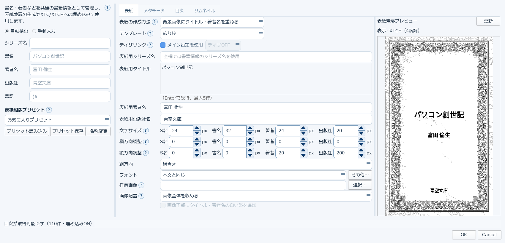
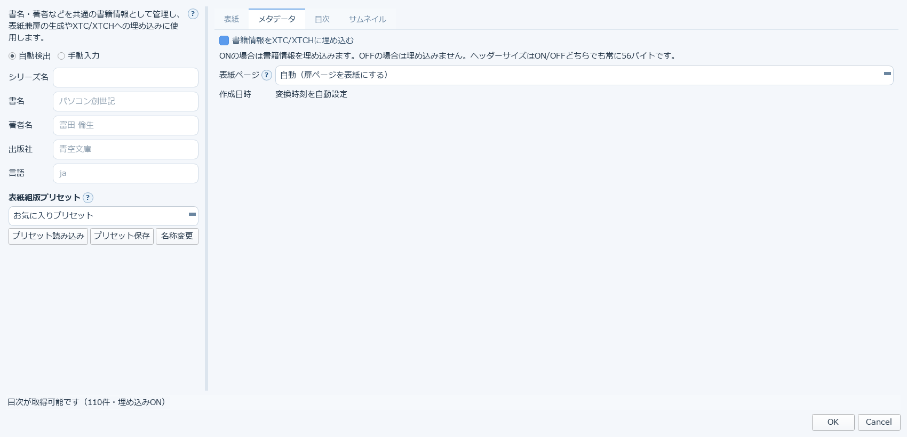
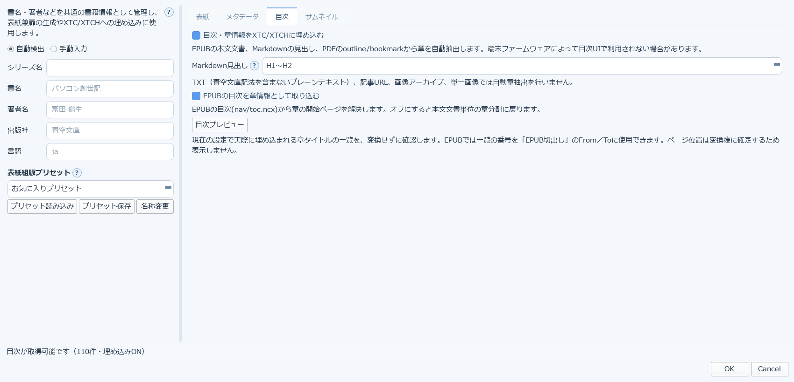
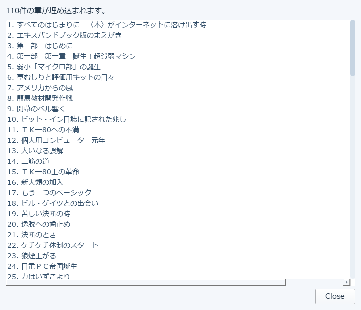
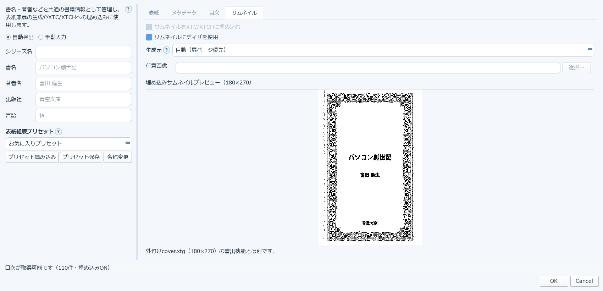

# 8. 書籍情報・表紙兼扉

**この章がv3の中心機能です。** 書名・著者名などの書誌情報と、表紙・目次・サムネイルを
まとめてここで決め、XTC/XTCHの中へ埋め込みます。端末の本棚での見え方は、ほぼこの設定で決まります。

ダイアログは4つのタブに分かれています。左側の**書誌情報欄は全タブ共通**で、常に表示されています。

---

## ⚠️ 先に読んでください：書籍情報は「1冊ごと」の設定です

書籍情報は、**変換対象のファイルごとに個別に保存されます**（内部でファイルのパス単位で記録しています）。
メイン画面の組版設定のように「全体に効く設定」ではありません。

これが特に効いてくるのが **[一括変換](12-folder-batch.md)** です。

- 一括変換は、**組版設定**（フォント・余白・画像処理など）はメイン画面の設定を全ファイルへ適用します
- しかし**書誌情報**は1冊ごとの情報なので、事前に設定していないファイルは**自動検出の結果**が使われます

つまり、まとめて変換してから「書名が思っていたのと違う」と気づく、ということが起こります。

> **おすすめの手順**: 一括変換にかける前に、1冊ずつファイルを開いて書籍情報を確認し、
> **既定のままで構わないので一度OKを押して確定させておく**。こうしておけば、
> 一括変換でもその内容が使われます。

---

## 8-1. 「表紙」タブ

表紙兼扉（本を開いて最初に出るページ）の作り方を決めます。

> この章の画面写真は、[青空文庫](10-aozora.md)から「パソコン創世記」（富田倫生）を
> ダウンロードした状態のものです。青空文庫から取り込むと、**書名・著者名が自動で入り、
> 出版社は「青空文庫」が設定されます**（左側の書誌情報欄）。
> 右のプレビューは、その情報から実際に生成された表紙です。

- **表紙の作成方法** … 「背景画像にタイトル・著者名を重ねる」など、表紙の作り方を選びます
- **テンプレート** … 「飾り枠」などのデザインを選びます
- **ディザリング** … 表紙の階調表現です。「メイン設定を使用」で本文と同じ扱いになります
- **表紙用シリーズ名／タイトル／著者名／出版社名** … **空欄なら左の書誌情報の値がそのまま使われます**。
  表紙だけ別の表記にしたいときにここへ入力します（タイトルはEnterで改行、最大5行）
- **文字サイズ／横方向調整／縦方向調整** … シリーズ名・書名・著者・出版社の4要素それぞれについて、
  大きさと位置を個別に調整できます
- **組方向** … 表紙を縦書き／横書きのどちらで組むか
- **フォント** … 「本文と同じ」または個別指定
- **任意画像／画像配置** … 用意した画像を表紙に使う場合の指定です

右側のプレビューで、変更結果をその場で確認できます（［更新］で再描画）。

## 8-2. 「メタデータ」タブ

XTC/XTCHのファイル内部に書き込む情報の設定です。

- **書籍情報をXTC/XTCHに埋め込む** … ONで埋め込みます。
  ヘッダーサイズはON/OFFどちらでも常に56バイトです
- **表紙ページ** … どのページを表紙として扱うか。既定は「自動（扉ページを表紙にする）」
- **作成日時** … 変換時刻が自動設定されます

## 8-3. 「目次」タブ

端末の目次機能で使われる章情報の設定です。

- **目次・章情報をXTC/XTCHに埋め込む** …
  EPUBの本文文書、Markdownの見出し、PDFのoutline/bookmarkから章を自動抽出します。
  **端末ファームウェアによっては目次UIで利用されない場合があります**
- **Markdown見出し** … どのレベルの見出しを章とみなすか（H1〜H2 など）
- **EPUBの目次を章情報として取り込む** …
  EPUBの目次(nav/toc.ncx)から章の開始ページを解決します。オフにすると本文文書単位の章分割に戻ります
- **［目次プレビュー］** …
  現在の設定で実際に埋め込まれる章タイトルの一覧を、変換せずに確認できます。
  EPUBでは一覧の番号を「[EPUB切出し](15-epub-split.md)」のFrom／Toに使えます

押すと、章の一覧がそのまま表示されます。

冒頭に「◯件の章が埋め込まれます。」と出るので、**変換前に章立てが意図どおりか確認**できます。
章が0件のときや、思ったより少ないときは、上の「Markdown見出し」や
「EPUBの目次を章情報として取り込む」の設定を見直してください。

> ページ位置は変換後に確定するため、この一覧には表示されません。

> **注意**: TXT（青空文庫記法を含まないプレーンテキスト）、記事URL、画像アーカイブ、単一画像では
> 自動章抽出を行いません。

## 8-4. 「サムネイル」タブ

端末の本棚に並んだときに表示される小さな画像の設定です。

- **サムネイルをXTC/XTCHに埋め込む**
- **サムネイルにディザを使用** … 階調を点の粗密で表現します（白黒端末での見栄えが良くなります）
- **生成元** … 既定は「自動（扉ページ優先）」。任意の画像も指定できます
- **埋め込みサムネイルプレビュー（180×270）** … 実際に埋め込まれるサムネイルがそのまま表示されます

> 外付けの `cover.xtg`（180×270）の書き出し機能とは別の設定です。
> `cover.xtg` は [XTCツール](14-xtc-tools.md)の画像ツールから作成します。

---

## どこから開くか

書籍情報ダイアログは、変換対象を選んだ状態でメイン画面から開きます。
[XTCツール](14-xtc-tools.md)からも、既存のXTC/XTCHに対して同じ編集ができます。

→ [9. Web記事を取り込む（記事URL）](09-article-url.md)
