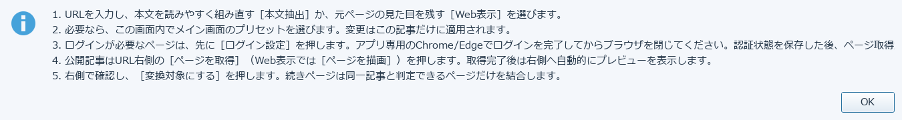
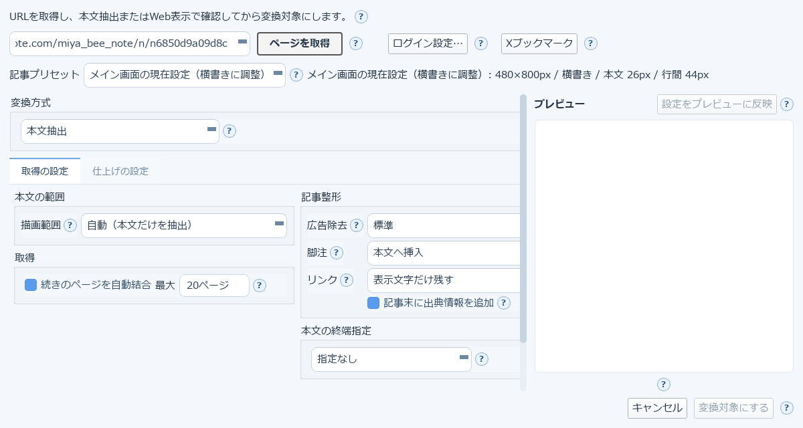
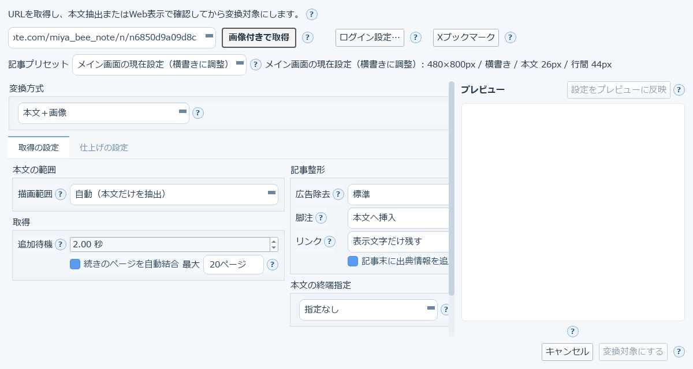
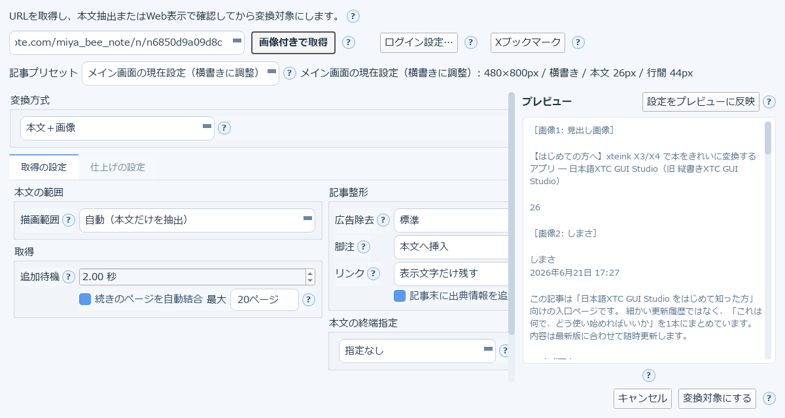
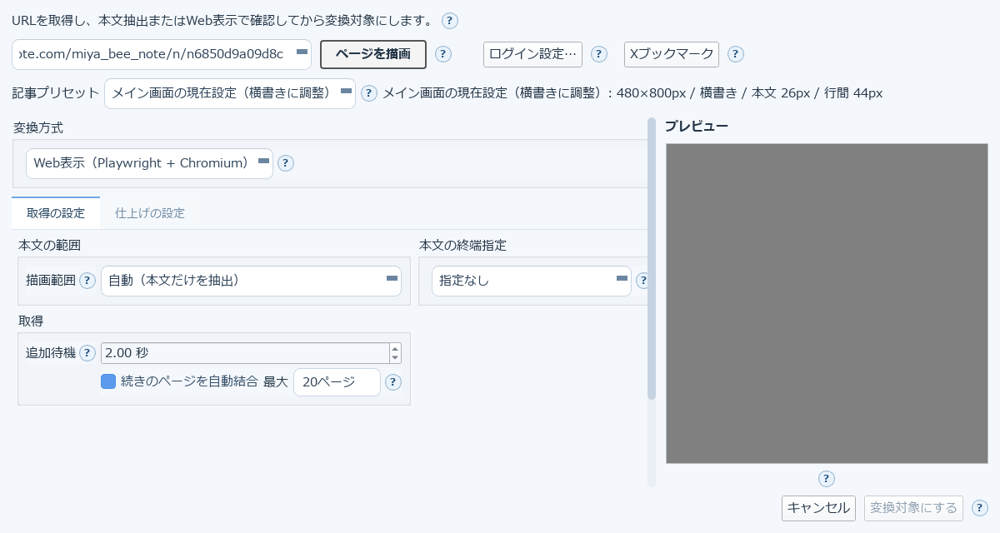

# 9. Web記事を取り込む（記事URL）

ニュース記事やブログなど、Web上の記事をXTC/XTCHの変換対象にする機能です。
上部ツールバーの「記事URL」から開きます。

アプリ内のヘルプ（`?`）に、使い方が5ステップでまとまっています。



1. URLを入力し、本文を読みやすく組み直す［本文抽出］か、元ページの見た目を残す［Web表示］を選ぶ
2. 必要なら、この画面内でメイン画面のプリセットを選ぶ（変更はこの記事だけに適用される）
3. ログインが必要なページは、先に［ログイン設定］を押す。アプリ専用のChrome/Edgeでログインを完了してからブラウザを閉じる。認証状態を保存した後、ページ取得ができるようになる
4. 公開記事はURL右側の［ページを取得］（Web表示では［ページを描画］）を押す。取得完了後は右側へ自動的にプレビューを表示する
5. 右側で確認し、［変換対象にする］を押す。続きページは同一記事と判定できるページだけを結合する

## 3つの取得方式

「変換方式」のプルダウンで切り替えます。

### 本文抽出（既定）

文章だけを取り出して、選んだプリセットの組版設定で読みやすく再構成します。広告や関係ないリンクが
混ざりにくいのが利点です。



- **本文の範囲**: 「自動（本文だけを抽出）」が既定。うまく抽出できないページでは範囲の指定方式を変更できます
- **記事整形**: 広告除去の強さ、脚注の扱い（本文へ挿入／記事末へまとめる／除外）、リンクの扱いを選べます
- **取得**: 「続きのページを自動結合」で、複数ページに分かれた記事をまとめて取得できます（最大ページ数指定あり）
- **本文の終端指定**: 記事末尾の関連リンクや広告など、不要な末尾を切り落とす指定ができます

### 本文＋画像

本文CSSセレクタの範囲内から本文と画像を取得し、画像をEPUB/XTCへ**挿絵として埋め込みます**。
小さい画像は自動除外し、最大50枚・合計100MBまで、画像キャッシュを再利用します。失敗画像は省略して
警告し、再取得できます（CSSの`background-image`は対象外）。



「画像付きで取得」ボタンに変わり、「追加待機」（画像の遅延読み込みを待つ秒数）の項目が現れます。

### 取得したところ

実際にnoteの記事を「本文＋画像」で取得した状態です。



右のプレビューに、抽出された本文と `［画像1: …］` のような**画像の差し込み位置**が並びます。
画面下の状態表示には、次のような結果が出ます。

```
本文を抽出しました（2663文字）
取得方法: Chromium DOM（本文＋画像）
画像: 4成功・0失敗・2自動除外・0上限スキップ
```

- **自動除外** … アイコンなど小さすぎる画像を、本文の邪魔になるため自動的に除いた枚数です
- ここで内容を確認してから **［変換対象にする］** を押します

### Web表示（Playwright + Chromium）

元ページのCSS・画像・表をChromiumで実際に描画し、選んだ端末寸法のページ画像として取り込みます。
記事構造が特殊で本文抽出がうまくいかないページ向けです。



取得ボタンは「ページを描画」になり、プレビューは端末寸法そのままの画像として表示されます。

## URL履歴・ブックマーク

一度取得したURLは履歴に残ります（最大5件）。よく使うサイトは「Xブックマーク」からアクセスできます。

## 記事プリセット

「メイン画面の現在設定（横書きに調整）」のように、メイン画面の設定を記事用にアレンジしたものを
選べます。プルダウンの右側に、選択中プリセットの寸法・組方向・本文サイズ・行間が一覧表示されます。

→ [10. 青空文庫の作品を取り込む](10-aozora.md)
