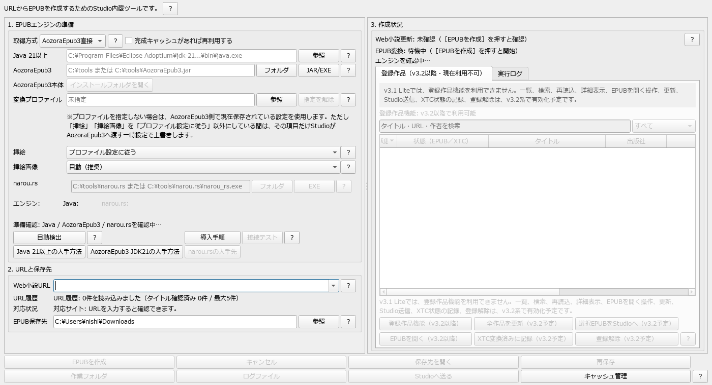
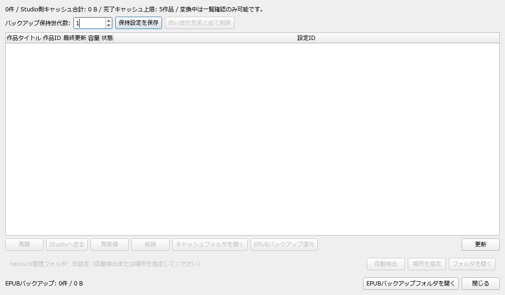

# 5. なろう小説をEPUB化する

上部ツールバーの「小説URL」から、「小説家になろう」などのWeb小説をEPUB化するための
専用ツールを開きます。これは外部エンジン（narou.rs / AozoraEpub3 / Java）と連携する機能です。

## 画面の構成

- **1. EPUBエンジンの準備**: Java・AozoraEpub3・narou.rsの場所を指定します。「自動検出」を押すと
  よくあるインストール場所から自動的に探します。導入がまだの場合は「Java 21以上の入手方法」
  「AozoraEpub3-JDK21の入手方法」「narou.rsの入手先」の各ボタンから案内を確認してください
- **2. URLと保存先**: Web小説のURLと、EPUBの保存先フォルダを指定します。URL履歴も残ります
- **3. 作成状況**: 準備確認の結果や、実行ログをここで確認します

## 使い方の流れ

1. 「自動検出」または「導入手順」でエンジンの準備を済ませる（一度設定すれば次回から不要）
2. Web小説URLを入力する
3. EPUB保存先を確認・変更する
4. 「EPUBを作成」を押す
5. 完成後、「Studioへ送る」でメイン画面の変換対象にできます

「キャッシュ管理」からは、これまでに作成したEPUBのキャッシュを確認・整理できます
（[キャッシュ管理ダイアログの詳細はこちら](#epubキャッシュ管理)）。

## 💎 登録作品一覧はFull版の機能です

作成状況欄の「登録作品」タブには、次のように表示されます。

> v3.1 Liteでは、登録作品機能を利用できません。一覧・検索・再読込、詳細表示、EPUB更新、
> Studio送信、XTC状態の記録、登録解除は、v3.2系で有効化予定です。

Lite版では、URLを都度入力してEPUBを作成する使い方になります。作品を一覧管理して更新チェックする
機能はFull版（v3.2以降）で使えます。

## EPUBキャッシュ管理

作成済みEPUBのキャッシュ一覧、バックアップ保持世代数の設定、古いキャッシュのまとめ削除ができます。
キャッシュ容量が一定を超えると、開いたときに警告が表示されます。

→ [6. フォルダをまとめて変換する（一括変換）](07-folder-batch.md)
