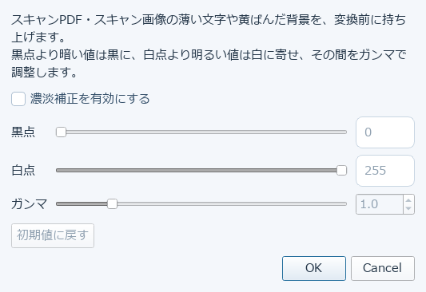

# 7. スキャンPDF・画像の下ごしらえ（濃淡補正）

スキャンした本や資料は、文字が薄かったり背景が黄ばんでいたりすることがあります。
「濃淡補正」は、そうしたスキャンPDF/画像の薄い文字や黄ばんだ背景を、変換前に持ち上げる機能です。

## 使い方

「濃淡補正を有効にする」にチェックを入れてから、3つのスライダーで調整します。

- **黒点**: これより暗い値を黒に寄せます
- **白点**: これより明るい値を白に寄せます
- **ガンマ**: 黒点と白点の間の明るさを調整します

「初期値に戻す」で、黒点0・白点255・ガンマ1.0（補正なし相当）に戻せます。

## この機能と「余白トリミング」の違い

濃淡補正は明るさ・コントラストの補正です。[2章](02-basic-settings.md#画像処理)で説明した
「余白トリミング」は、ページごとにインク領域を検出して余白を切り、実効文字サイズを引き上げる機能で、
役割が異なります。スキャン原稿では両方を組み合わせると効果的です。

→ [8. 書籍情報・XTCツールで確認・編集する](05-xtc-tools.md)
