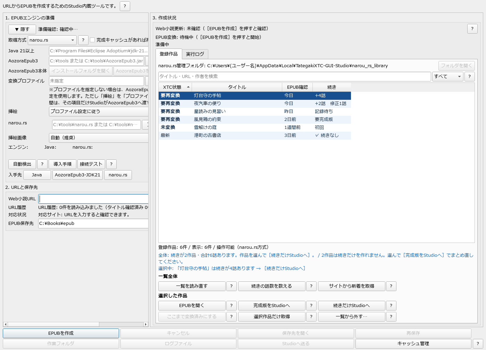
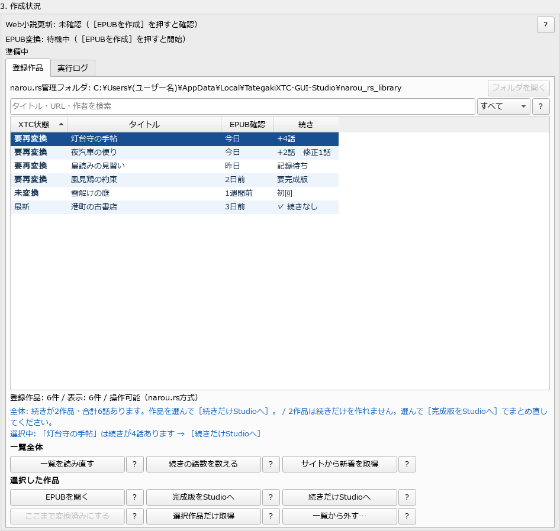
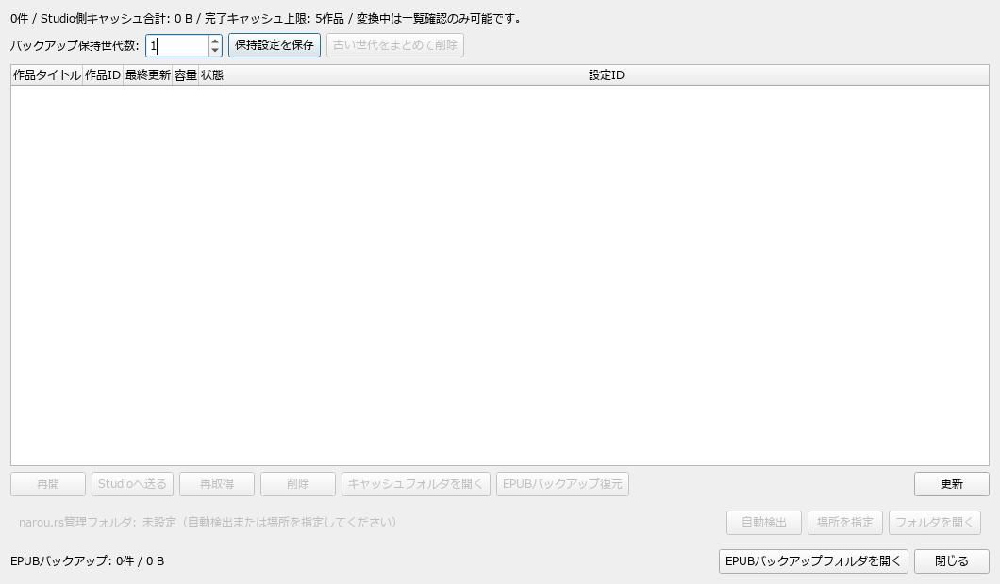

# 11. Web小説をEPUB化し、連載の続きを読む（小説URL）

上部ツールバーの「小説URL」から、「小説家になろう」などのWeb小説をEPUBにするための
専用ウィンドウ（EPUB作成ヘルパー）を開きます。
できたEPUBは、そのままStudioへ送ってXTC／XTCHへ変換できます。

narou.rs方式で作った作品は「登録作品」として一覧に入り、まとめて新着を取り込めます（→ [登録作品の管理](#登録作品の管理)）。

**【v3.3から】** 開発中の v3.3（未公開）では、連載中の作品を**続きの話だけ**XTCにする更新管理が加わります。
すでに端末で読んでいる作品に新しい話が増えたとき、全話を作り直さずに、
増えた話だけの1冊（例: `作品名 第129-132話`）を作れます（→ [連載の更新管理](#v33から連載の更新管理続きだけxtc)）。
公開中の v3.2.1 では、全話を変換し直してください。

この機能は外部ツールと連携して動きます。**どれも本アプリには同梱していない第三者製のツール**なので、
あらかじめご自身で用意してください。

| ツール | 必要なとき | 入手先 |
|---|---|---|
| Java 21 以上 | 常に | 画面の［Java］ボタンから案内を開けます |
| AozoraEpub3-JDK21 | 常に | https://aozoraepub3-jdk21.github.io/AozoraEpub3-JDK21/ |
| narou.rs | narou.rs方式を使うとき（登録作品の管理には必須） | https://github.com/Rumia-Channel/narou.rs |

> 📸 写真は v3.3 の画面です。取得方式に narou.rs を選び、「登録作品」タブに作品が並んだ状態です。
> v3.2.1 では、登録作品一覧の列とボタンが一部違います（[後述](#登録作品の管理)）。
> **作品名・URLは説明用の架空のもの**で、エンジンの場所は空欄にしてあります。

## 2つの取得方式

「1. EPUBエンジンの準備」の **取得方式** で選びます。

| 取得方式 | しくみ | 向いている使い方 |
|---|---|---|
| **narou.rs**（既定） | narou.rs が作品を取得・管理し、AozoraEpub3 でEPUBにします。同じ作品をもう一度実行すると、新しく公開された話だけを取りにいきます | **連載中の作品を追いかける**。作品は「登録作品」一覧に入ります（【v3.3から】続きだけのXTCも作れます） |
| **AozoraEpub3直接** | URLをAozoraEpub3へそのまま渡してEPUBを作ります | 完結済みの作品を1回だけEPUBにする。narou.rs を入れていない場合 |

> narou.rs方式では、Web取得が新着分だけでも、**できあがるEPUBは最新の全話を含む1冊**です。
> 差分が確実に判定できないときは、無理に差分で済ませず全体を作り直します。
> 【v3.3から】「続きだけ」の1冊は、このEPUBから**Studioが切り出して**作ります（後述）。

**登録作品の管理（一覧の操作、【v3.3から】続きだけの変換）は narou.rs 方式でだけ使えます。**
narou.rs を導入済みのまま「AozoraEpub3直接」を選んでいると、取得方式の横に
「⚠ この方式では登録作品の管理を使えません」と表示されます
（v3.3 では「⚠ この方式では登録作品の管理と［未変換の続きだけStudioへ］を使えません」）。
連載を追いかける作品は、**最初にEPUBを作るときから** narou.rs 方式にしてください。

「完成キャッシュがあれば再利用する」は、**AozoraEpub3直接のときだけ**働きます（既定はオフ）。
オフでは毎回URLを取り直して新着話を反映します。narou.rs方式はこの指定と関係なく、
本文に変更がなければ前回のEPUBをそのまま使います。

## 画面の構成

### 1. EPUBエンジンの準備

| 項目 | 内容 |
|---|---|
| 取得方式 | narou.rs／AozoraEpub3直接 |
| Java 21以上 | Java の場所。［参照］で指定 |
| AozoraEpub3 | ［フォルダ］でJARを含むフォルダ、［JAR/EXE］で本体を直接指定。［インストールフォルダを開く］［AozoraEpub3を起動］も並びます |
| 変換プロファイル | AozoraEpub3で保存したINIプロファイルを任意で指定。未指定ならAozoraEpub3側でいま保存されている設定を使います。［指定を解除］で外せます |
| 挿絵 | 含める／含めない／プロファイル設定に従う |
| narou.rs | ［フォルダ］で配布フォルダ、［EXE］で `narou_rs.exe` を指定 |
| 挿絵画像 | **自動（推奨）**／しない。自動では800×1200pxを超える挿絵だけを、縦横比を保ってJPEG品質95に縮小します |

- **［自動検出］** … よくある場所からJava・AozoraEpub3・narou.rsを探します
- **［導入手順］** … 各ツールの入れ方を表示します
- **［接続テスト］** … 準備が整ったか確かめます
- **［Java］［AozoraEpub3-JDK21］［narou.rs］** … 各ツールの入手先を開きます

準備が済むと、見出しの **［▼ 隠す］** で欄を畳めます。畳んでいる間は
「準備完了（Java … / AozoraEpub3 … / narou.rs …）」のように1行で状態が出ます。
準備が済んでいない間は、畳まずに開いたままになります。

> **narou.rs は配布アーカイブをフォルダごと展開してください。**
> `narou_rs.exe` だけをコピーすると、構成ファイルが足りず使えません。
> narou.rs の管理データは `%LOCALAPPDATA%\TategakiXTC-GUI-Studio\narou_rs_library\` に保存されます。

### 2. URLと保存先

- **Web小説URL** … `http://` または `https://` で始まるURL。▼から直近5件の履歴を選べます
  （履歴にカーソルを合わせると、取得済みの作品タイトルが出ます）
- **対応状況** … 入力したURLのサイトへの対応状況（[下の表](#対応サイト)）
- **EPUB保存先** … 同じ名前のファイルがある場合は上書きせず、`_2` などを付けて保存します

### 3. 作成状況

「Web小説更新」「EPUB変換」の状態と、2つのタブがあります。

- **登録作品** … narou.rsで管理している作品の一覧（[後述](#登録作品の管理)）
- **実行ログ** … AozoraEpub3・narou.rsの出力

下部のボタン:

| ボタン | 内容 |
|---|---|
| EPUBを作成 ／ キャンセル | 入力中のURLでEPUBを作る／中止する |
| Studioへ送る | できたEPUBをメイン画面の変換対象にする |
| 保存先を開く ／ 再保存 | EPUBの保存先を開く／保存に失敗したときにやり直す |
| 作業フォルダ ／ ログファイル | 作業用フォルダ・ログファイルを開く |
| キャッシュ管理 | 作成済みEPUBのキャッシュを整理する（[後述](#epubキャッシュ管理)） |

> EPUBをStudioへ渡すと（［Studioへ送る］［完成版をStudioへ］のどちらでも。v3.3 では［全話をStudioへ］［未変換の続きだけStudioへ］も）、
> **このウィンドウは自動で閉じ**、メイン画面が前に出ます。もう一度開くときは「小説URL」を押してください。
> 【v3.3から】閉じても、渡した記録はディスクに残るので、変換後の自動記録（後述）は働きます。

## はじめて作品をEPUBにする

1. 「自動検出」または「導入手順」でエンジンの準備を済ませる（一度設定すれば次回から不要）
2. 「接続テスト」で準備ができたことを確かめる
3. Web小説のURLを入力する
4. EPUB保存先を確認・変更する
5. 「EPUBを作成」を押す（narou.rs方式では、ここで作品が登録作品に入ります）
6. 完成後、「Studioへ送る」でメイン画面の変換対象にする

Studioへ送ると、最初のプレビューができてから「書籍情報」の確認が出ます。

連載を続けて追いかける作品は、変換が終わったら登録作品一覧で **［ここまで変換済みにする］** を押して記録しておきます
（[変換済みの記録](#変換済みの記録v321)）。
【v3.3から】v3.3 では、**［全話をStudioへ］で全話を1回変換しておく**と記録が自動で付き、
次からは続きだけを作れるようになります（[初回](#続き列の表示)の扱いを参照）。

## 対応サイト

アプリがURLを識別して案内するサイトと、v3.2.1 時点の状態です（v3.3 でも同じです）。

| サイト | 状態 |
|---|---|
| 小説家になろう（syosetu.com） | 確認済み |
| カクヨム（kakuyomu.jp） | 外部エンジン依存（当方未検証） |
| ハーメルン（syosetu.org） | 外部エンジン依存（当方未検証） |
| アルファポリス（alphapolis.co.jp） | Studio側で取得に対応（公開話のみ） |
| ノベルアップ＋ ／ エブリスタ ／ ノベルバ | URLは識別しますが、取得は未検証 |

- ノクターンノベルズ・ムーンライトノベルズ・ミッドナイトノベルズは、小説家になろうと同じ
  syosetu.com として識別します。年齢確認が必要なサイトは取得できない場合があります
- 【v3.3から】連載の更新管理（続きの判定）は、サイトの種類によらず、手元のEPUBの中身で判定します
- Web小説サイトは、HTML構造の変更・アクセス制限・年齢確認・仕様変更などで取得できる内容が変わります。
  対応状況は narou.rs・AozoraEpub3 本体の更新にも左右されます
- 取得したデータの利用は、各サイトの利用規約と私的利用の範囲でお願いします

---

## 登録作品の管理

narou.rs方式で一度EPUBを作った作品は、「登録作品」タブの一覧に入ります。
連載中の作品を、ここでまとめて管理・取得します。

> 📸 v3.3 の画面です（作品名は説明用の架空のもので、「灯台守の手帖」を選んでいます）。
> v3.2.1 では、列が「状態」「タイトル」「出版社」「EPUB」「最終確認」で、
> ［続きの話数を数える］［未変換の続きだけStudioへ］［選択作品だけ取得］のボタンと、一覧の下の案内はありません。

### 新しい話を端末で読むまでの流れ（v3.2.1）

1. **［サイトから新着を取得］** を押して、登録作品をまとめてサイトから取り直す
   （通信を伴い、話数の多い作品では時間がかかります）
2. 取得が終わると一覧が作り直されます。EPUBが新しくなった作品は「状態」が **要再変換** になります
3. その作品を選んで **［完成版をStudioへ］** を押す。EPUB全体（全話）がメイン画面の変換対象になります（このウィンドウは閉じます）
4. メイン画面で **［変換実行］**
5. 変換が終わったら、もう一度「小説URL」を開き、その作品を選んで **［ここまで変換済みにする］** を押す。
   「状態」が **最新** になります
6. できたXTC/XTCHを端末へ送る（[16章](16-device-transfer.md)、またはSDカードへコピー）

### 一覧の見かた

一覧の上に、**narou.rs管理フォルダ**の場所と［フォルダを開く］、検索欄（タイトル・URL・作者）、
絞り込み（「状態」の値で絞る）、表の説明を出す［？］があります。

| 列 | 内容 | 既定 |
|---|---|---|
| **状態** | 取得したEPUBと、XTCへ変換した記録との関係（[下表](#状態列の表示)） | 表示 |
| **タイトル** | 作品名 | 表示 |
| **出版社** | 掲載サイト | 隠す |
| **EPUB** | EPUBのファイル名 | 隠す |
| **最終確認** | 最後に確認した日（「今日」「昨日」「3日前」など）。正確な日時は詳細に出ます | 表示 |

- 隠してある列は、一覧を右クリックして［表示する列］から出せます。列の幅はドラッグで変えられ、変えた幅は保存されます
- 列の見出しをクリックすると並べ替えます

#### 「状態」列の表示

取得したEPUBと、XTCへ変換した記録との関係です。**Studioが自動で追いかけるものではありません。**
変換したら［ここまで変換済みにする］を押すと「最新」になります。

| 表示 | 意味 | 次にすること |
|---|---|---|
| **要再変換** | 前回XTCへ変換したときより、EPUBが新しくなっている | 変換し直してから［ここまで変換済みにする］ |
| **未変換** | EPUBはあるが、XTCへ変換した記録がまだない | 変換してから［ここまで変換済みにする］ |
| **最新** | 現在のEPUBは変換済みとして記録されている | なし |
| **EPUBなし** | 対応する有効なEPUBが見つからない | narou.rsの出力設定を確認する |
| **EPUB不正** | EPUBの検証に失敗した | 生成ログとEPUBを確認する |
| **凍結中** | narou.rs側で凍結されている | なし（narou.rsの設定で解除） |

### ボタン（v3.2.1）

ボタンの右の［？］で、そのボタンの説明が開きます。

| ボタン | 内容 | 通信 |
|---|---|---|
| 一覧を読み直す | narou.rsの管理フォルダを読み直して一覧を作り直す。外部でEPUBを差し替えたときなどに使う（数秒） | なし |
| サイトから新着を取得 | 登録作品をまとめてサイトから取り直し、EPUBを作り直す。凍結作品・更新間隔・強制更新の扱いはnarou.rs側の設定に従う | **あり**（長くかかる） |
| 完成版をStudioへ | 選んだ作品のEPUB全体（全話）をStudioへ渡す。**渡すだけで、変換は始まりません** | なし |
| EPUBを開く | EPUBを既定のアプリで開く。Studioへは渡さない | なし |
| ここまで変換済みにする | 現在のEPUBを、XTCへ変換済みとして記録する。**記録するだけで、変換は行いません**。Studioでの変換が終わってから押す | なし |
| 一覧から外す… | Studioの一覧と更新対象から外す。**narou.rsの管理データとEPUBファイルは削除しません**。確認のうえ実行 | なし |

取得の実行中は、競合する操作（一覧の読み直し・登録解除など）は押せなくなります。

### 変換済みの記録（v3.2.1）

v3.2.1 では、**変換が終わったら［ここまで変換済みにする］を手で押して**記録します。
押さないと、変換したあとも「状態」は「要再変換」または「未変換」のままです。

**記録を取り消したいとき**は、一覧で「最新」の作品を右クリックして［「XTC変換済み」の記録を取り消す…］を選びます。
押し間違えたときに「要再変換」「未変換」へ戻せます。**作成済みのXTCファイルは削除しません。**

### 更新を確認するタイミング

- 常駐監視や、起動時の自動通信は行いません
- サイトを見にいくのは、入力中の1作品は［EPUBを作成］、登録作品は［サイトから新着を取得］を押したときだけです
  （【v3.3から】［選択作品だけ取得］も）
- 凍結作品・更新間隔・強制更新などの扱いは、narou.rs側の設定に従います
- 「状態」は、EPUBの更新日時とサイズで変更の候補を絞り、必要なときは内容の指紋（SHA-256）で比べて決めます

### 右クリックメニューと並び順

行を**右クリック**すると、その作品への操作がまとめて出ます。

- 詳細を表示…（ダブルクリックでも同じ。送信はしません）
- EPUBを開く ／ EPUBのある場所を開く ／ 作品ページをブラウザで開く
- コピー（タイトル・作品URL・EPUBのパス）
- 完成版をStudioへ ／ ここまで変換済みにする ／ 「XTC変換済み」の記録を取り消す…
  （v3.3 では 全話をStudioへ ／ 続きの話数を数える ／ 未変換の続きだけStudioへ も並びます）
- 並び順 ／ 表示する列
- 一覧から外す（登録解除）…

並び順は、既定では列の見出しをクリックして並べ替えます。右クリックの［並び順］→［手動で並べ替える］にすると、
上へ・下へ・先頭へ・末尾へで好きな順に置けます（手動の並びは管理フォルダに保存され、
新しく登録した作品は末尾に付きます）。［並び順をリセット（登録順）］で元に戻せます。

### AozoraEpub3直接方式のとき

取得方式が「AozoraEpub3直接」の間は、一覧は**閲覧専用**になります。
EPUBを開く・詳細を見ることはできますが、取得・Studioへの受け渡し・記録・登録解除はできません。

### バッチ実行との関係

[20章](20-batch-mode.md)のバッチ実行モードでも、なろう等のURLを指定すると、narou.rs方式なら
同じ管理フォルダ・登録作品データを使って取得します。ただし、登録作品の一覧に
相当する機能はありません（1 URLずつ取得して完成版を変換します）。

---

## 【v3.3から】連載の更新管理（続きだけXTC）

> **この節は、開発中の v3.3（β版・未公開）で初めて入る機能の説明です。** 公開中の v3.2.1 にはありません。

v3.3 では、登録作品の「続き」（手元のEPUBにあって、まだXTCにしていない話）を数え、
**続きの話だけを1冊のXTC**にできます。変換が終わると、その記録も自動で付きます。

### v3.3で変わる列と名前

| | v3.2.1 | v3.3 |
|---|---|---|
| 変換の記録を表す列 | 状態 | **XTC状態**（表示の値は同じ。「候補複数」が加わる） |
| 最後に確かめた日の列 | 最終確認 | **EPUB確認**（手元のEPUBを最後に調べた日。サイトへ接続した日時ではありません） |
| 加わる列 | — | **続き**（[下表](#続き列の表示)）、**前回送信**（既定で隠す） |
| 全話を渡すボタン | ［完成版をStudioへ］ | **［全話をStudioへ］** |
| 続きだけを渡すボタン | — | **［未変換の続きだけStudioへ］** |
| 変換済みの記録 | ［ここまで変換済みにする］を手で押す | **変換が終わると自動で記録**（［ここまで変換済みにする］は自動記録できなかったときに使う） |

「XTC状態」の **候補複数** は、対応するEPUBが複数あるという意味です（narou.rsの出力先を整理してください）。
「XTC状態」「続き」の見出しで並べ替えると、**手を動かす必要があるものが先に**来ます
（「続き」は話数を数として比べるので、`+10話` が `+2話` より前に来ます）。

### 最初に：「新着」と「続き」は別のものです

この画面では、2つの言葉を使い分けています。ここを取り違えると、
「続きなし」と出ているのに新しい話が読めない、ということが起きます。

| 言葉 | 意味 | 調べるボタン |
|---|---|---|
| **新着** | **サイト側**で公開されたが、まだ手元のEPUBに取り込んでいない話 | ［サイトから新着を取得］［選択作品だけ取得］（通信します） |
| **続き** | **手元のEPUB**にはあるが、まだXTCにしていない話 | ［続きの話数を数える］（通信しません） |

つまり、サイトに新しい話が出たら、まず**新着を取り込んでEPUBを新しくし**、
それから**続きを数えて、続きだけをXTCにする**、という2段階になります。

### 新しい話を端末で読むまでの流れ（v3.3）

1. **［サイトから新着を取得］** を押して、登録作品をまとめてサイトから取り直す。
   1作品だけなら、その行を選んで **［選択作品だけ取得］**
   （どちらも通信を伴い、話数の多い作品では時間がかかります）
2. 取得が終わると、一覧と「続き」列が自動で作り直されます。
   **「続き」列に `+4話` のように出た作品**が、続きのある作品です
3. その作品を選んで **［未変換の続きだけStudioへ］** を押す。
   続きの話だけを含むEPUBが作られ、メイン画面の変換対象になります（このウィンドウは閉じます）
4. メイン画面で **［変換実行］**。出力設定の確認ダイアログで、ファイル名と保存場所を確かめてから変換します
5. **変換が終わると、自動で「変換済み」として記録されます。**
   次に続きを数えるときは、いま変換した話の次からになります
6. できたXTC/XTCHを端末へ送る（[16章](16-device-transfer.md)、またはSDカードへコピー）

続きの数え方・記録のしかたで迷ったら、一覧のすぐ下に出る**「次の一手」の案内**を見てください（[後述](#次の一手の案内)）。

> **全話をまとめて作り直したいとき**は、手順3で **［全話をStudioへ］** を押します。
> 全話を変換したときも、同じように自動で記録され、続きの起点がその最終話まで進みます。

#### 「続き」列の表示

手元のEPUBのうち、**まだXTCにしていない話**です。一覧を開いたとき・読み直したとき・
取得が終わったときに自動で数えます（サイトは見にいきません）。

| 表示 | 意味 | ［未変換の続きだけStudioへ］ |
|---|---|---|
| **未確認** | まだ数えていない | ［続きの話数を数える］で数える |
| **✓ 続きなし** | まだXTCにしていない話はない | — |
| **+4話** | 続きが4話ある | **押せる** |
| **修正1話** | 新しい話はないが、すでに変換した話が1つ書き換わっている | 押せない。［全話をStudioへ］で反映 |
| **+2話　修正1話** | 続きが2話あり、既存の話も1つ書き換わっている | 押せる（**修正した話は含まれません**） |
| **記録待ち** | 続きだけを渡したが、まだ変換済みと記録されていない | 変換が終わると消える（[後述](#記録待ちが消えないとき)） |
| **要完成版** | 話の削除・順序変更などで、続きだけを安全に作れない | 押せない。［全話をStudioへ］ |
| **初回** | 前回変換した記録がない | 押せない。［全話をStudioへ］ |
| **EPUB未取得** | EPUBがまだない | ［サイトから新着を取得］ |
| **話単位で扱えません** | EPUBを話ごとに分けられない（本文が1つの文書になっているなど） | 押せない。［全話をStudioへ］ |

「要完成版」「修正」の行にマウスを乗せると、理由と対象の話（例: `修正: 第37話`）が出ます。

### 「次の一手」の案内

一覧の下には、いまの状態から決まる**次に押すボタン**が1〜2行で出ます。

- **全体:** 一覧全体のまとめ。例: 「登録作品の状況：続きを変換可能 2作品（合計6話） ／ 全話の作り直しが必要 2作品」
- **選択中:** 選んでいる作品について。例: 「未変換の続きが4話あります。［未変換の続きだけStudioへ］を押し、Studioで変換してください。」

青は「押せるものがある」、橙は「注意が要る」、赤は「失敗した」という意味です。
ボタンを押しても何も起きないように見えるときは、その理由もここに出ます
（例: 「先に［続きの話数を数える］を実行してください。」）。

### v3.3で増えるボタン

v3.2.1 のボタン（［完成版をStudioへ］は［全話をStudioへ］に改名）に、次の3つが加わります。

| ボタン | 内容 | 押せるとき |
|---|---|---|
| 続きの話数を数える | 全作品の「続き」を数え直す。取得・変換・送信は行わない（**通信なし**） | narou.rs方式のとき |
| 未変換の続きだけStudioへ | 続きの話だけのEPUBを作ってStudioへ渡す | 「続き」に `+N話` があるとき |
| 選択作品だけ取得 | その作品だけをサイトから取り直し、EPUBの作成まで行う。終わると「続き」も数え直す | narou.rs方式で、作品を選んでいるとき（**通信あり**） |

v3.3 の［ここまで変換済みにする］は、**自動記録できなかったときに**、実際に作ったXTC/XTCHを選んで手で記録するボタンです
（Studioへ渡した記録が残っているときに押せます）。

### 続きだけXTC（追補版）のしくみ

［未変換の続きだけStudioへ］は、最新の完成EPUBから**続きの話だけを切り出したEPUB**を作り、
それをいつもの経路でStudioへ渡します。組版・ルビ・挿絵の扱いは、全話を変換したときと同じです。

- **書名に話の範囲が入ります。** 例: `灯台守の手帖 第129-132話`（1話だけなら `第129話`）。
  端末の本棚で、完成版や前の追補版と見分けるためです。
  書名欄は日本語で約42文字までなので、作品名が長いときは**作品名の側を切り詰め、範囲は必ず残します**
- **修正された話は入れません。** 入れると、同じ話が端末の上で2か所にできるためです。
  修正を反映したいときは、全話を作り直してください
- 入るのは**連続した続きだけ**です。飛び飛びの話を1冊にまとめることはしません
- 書名・著者などは、Studioで開いたときの「書籍情報」の確認で変えられます。
  **出力ファイル名**は、変換実行時の確認ダイアログで確かめ、必要なら変えてください

### 続きをどう判定しているか

Web小説のEPUBには、話ごとの決まったIDがありません（サイトによらず同じです）。
そこでStudioは、**前回XTCにした話の本文と、いまのEPUBの話の本文を、先頭から順に突き合わせて**
（本文から計算した指紋で）同じ話かどうかを確かめます。

- 前回までの話がすべて一致し、後ろに話が増えている → `+N話`
- 一致しない話が**1か所だけ**で、その位置が確かめられる → その話を「修正」とみなす
- 次のときは、続きだけを作ると端末の上で話が抜けたり重なったりするおそれがあるので、**「要完成版」**にします
  - 話数が前回より**減っている**（削除、または取得が途中で切れた）
  - 前回と一致しない話が**2か所以上**ある（削除・挿入・順序の入れ替えと区別できない）
  - 前回の最終話の位置が一致せず、話も増えている（最終話の直前に話が挿入された場合と区別できない）
  - 増えた話の本文が、既存の話と同じ（挿入・並べ替え・重複の可能性）
  - 既存の話の挿絵を確かめられない（外部参照・欠落）

比べる相手は「前回見たとき」ではなく、**XTCへ反映済みと記録された話**です。
そのため［続きの話数を数える］を何度押しても、変換するまでは同じ続きが出続けます。

> 判定に迷う形は、推測せず「要完成版」に倒します。続きを作れないことはあっても、
> **間違った続きを作ることはしない**、という方針です。

### 変換済みの記録（自動記録）

［全話をStudioへ］［未変換の続きだけStudioへ］で渡すと、Studioは**何を渡したか（どの話を、どの内容で）**を
ディスクに控えます。メイン画面で変換が**最後まで終わると**、その控えと実際に書き出したXTC/XTCHを対応付けて、
次の2つを自動で記録します。

- 「XTC状態」列 … **最新**になる
- 「続き」の起点 … 変換した話まで進む（続きだけのときは、続きに入れた話だけ。修正話は進めません）

自動記録には、次の性質があります。

- EPUB作成ヘルパーのウィンドウを**閉じていても**働きます
- 変換を**途中で停止したとき**は記録しません
- 変換したファイルが、渡したEPUBと**同じものか**は、場所または内容の一致で確かめます。
  渡したあとにファイルの中身が変わっていた場合や、どの作品のものか決められない場合は、記録しません
- 変換中に作品が更新されても、**渡した時点の内容**だけを変換済みにします

記録できなかったときは、メイン画面のログに「連載作品を変換済みとして自動記録できませんでした: （理由）」と出ます。
このときは控えが残っているので、**［ここまで変換済みにする］** を押し、実際に作ったXTC/XTCHを選んで
確認に「はい」と答えると、手で記録できます。

**記録を取り消したいとき**は、一覧で「最新」の作品を右クリックして［「XTC変換済み」の記録を取り消す…］を選びます。
最後に記録した変換を、2つの記録（「XTC状態」と「続き」の起点）から一緒に取り消します。
その前に記録した変換があれば、「XTC状態」はその変換の記録に戻ります。**作成済みのXTCファイルは削除しません。**

### 記録待ちが消えないとき

［未変換の続きだけStudioへ］で渡すと、その作品の「続き」は **記録待ち** になります。
変換が終わって記録されると消え、続きが数え直されます。
ウィンドウを閉じて開き直しても、記録されるまでは「記録待ち」のままです。

消えないときは、次のどれかです。

- 変換をまだしていない、または途中で停止した → 変換をやり直す
- 別のファイルを変換した、または渡したあとにファイルが変わった → もう一度［未変換の続きだけStudioへ］から
- 自動記録に失敗した（メイン画面のログに理由が出ます） → ［ここまで変換済みにする］で手で記録する

### まだできないこと（v3.3）

- 端末への送信履歴との連動（「前回送信」列は現在つねに「—」です）
- 直前の数話を重ねて入れた続き、複数作品の続きをまとめて作ること
- 端末側にある古い追補版の整理（端末内のファイルは削除しません）
- バッチ実行モードで続きだけを変換すること

## EPUBキャッシュ管理

作成済みEPUBのキャッシュ一覧、バックアップ保持世代数の設定、古いキャッシュのまとめ削除ができます。
キャッシュ容量が一定を超えると、開いたときに警告が表示されます。

→ [12. フォルダをまとめて変換する（一括変換）](12-folder-batch.md)
