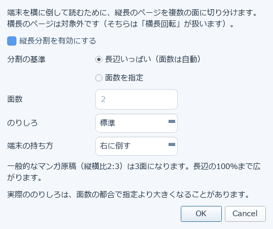
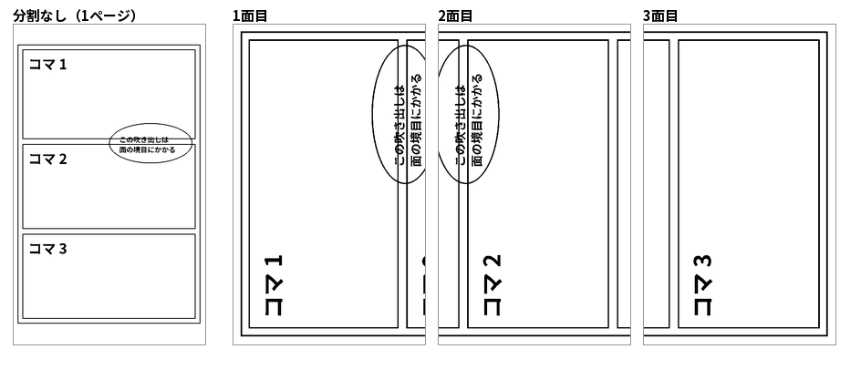

# 13. 画像・スキャンPDFの下ごしらえ

スキャンした本や資料は、文字が薄かったり背景が黄ばんでいたりすることがあります。
「濃淡補正」は、そうしたスキャンPDF/画像の薄い文字や黄ばんだ背景を、変換前に持ち上げる機能です。

## 使い方

「濃淡補正を有効にする」にチェックを入れてから、3つのスライダーで調整します。

- **黒点**: これより暗い値を黒に寄せます
- **白点**: これより明るい値を白に寄せます
- **ガンマ**: 黒点と白点の間の明るさを調整します

「初期値に戻す」で、黒点0・白点255・ガンマ1.0（補正なし相当）に戻せます。

## この機能と「余白トリミング」の違い

濃淡補正は明るさ・コントラストの補正です。[3章](03-typesetting.md#画像処理)で説明した
「余白トリミング」は、ページごとにインク領域を検出して余白を切り、実効文字サイズを引き上げる機能で、
役割が異なります。スキャン原稿では両方を組み合わせると効果的です。

## 縦長分割

縦長のページを、**端末を横に倒して読む向き**に切り分ける機能です。
1ページを複数の「面」に分け、面をめくって読みます。
端末はページ送りしかできないため、スクロールではなくこの形にしています。

「画像処理」の **縦長分割** にチェックを入れ、［設定…］で中身を決めます。
**既定は無効**で、有効にしない限り変換結果はこれまでと変わりません。

### 設定の中身

- **分割の基準**
  - **長辺いっぱい**（既定） … 画像の幅を画面の長辺に合わせ、必要な面数を自動で決めます
  - **面数を指定** … 面数を先に決め、そこに収まるまで縮小します。めくる回数は減りますが表示は小さくなります
- **のりしろ** … 面をどれだけ重ねるか。少なめ／標準（既定）／多め
- **端末の持ち方** … 右に倒す（既定）／左に倒す

### 見え方

一般的なマンガ原稿（縦横比2:3）だと **1ページが3面**になります。
下は、同じページを分割しないで変換したものと、3面に分けたものです。

面をまたぐ吹き出しが1面目と2面目の両方に写っているのが「のりしろ」です。
マンガのセリフが境目で切れても読めるように、面を少し重ねてあります。
**実際ののりしろは、指定より大きくなることがあります。**
面が等間隔になるように重なりを均すためで、指定値は下限として働きます。

「面数を指定」で2面にすると、長辺の77%までしか広がりません
（3面なら100%）。めくる回数と大きさのどちらを取るかで選んでください。

### 決まりごと

- **ページ番号は、元の画像1枚を1ページとして数えます。** 面ごとには進みません。
  目次に印刷されたページ番号と突き合わせられるようにするためです
- **表紙は分割しません**
- **横長のページは対象外**です。そちらは「横長回転」が扱います
- 縦に非常に長い画像でも **6面が上限**です。気づかないうちにページ数が跳ね上がるのを防ぎます
- 右ペインのプレビューも、実際の変換と同じ面数・同じページ番号で表示されます

### 対象になるファイル

画像アーカイブ（ZIP / CBZ / CBR / RAR）、PDF、単体の画像ファイル、
[フォルダの一括変換](12-folder-batch.md)。テキストやEPUBは対象外です。

→ [14. XTCツールで確認・編集する](14-xtc-tools.md)
