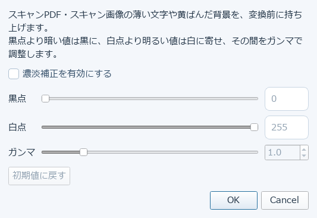
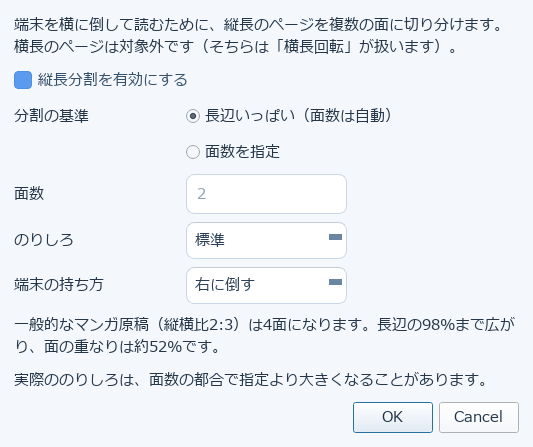
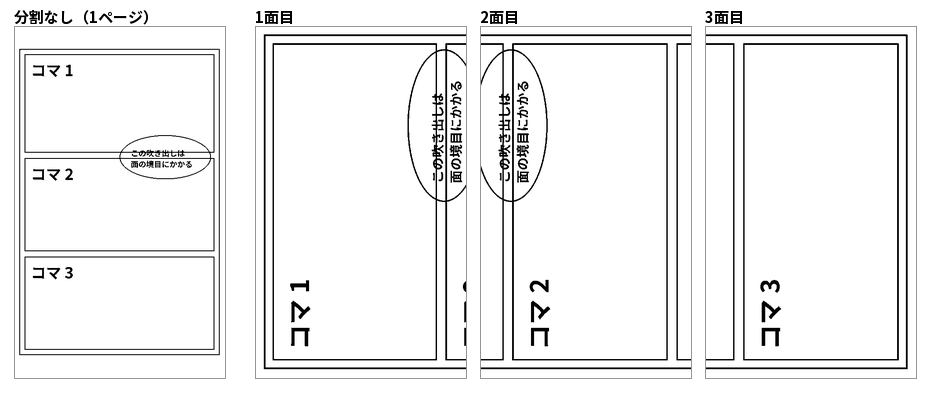
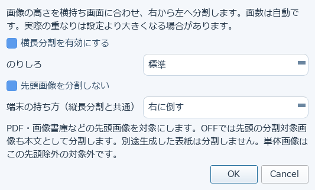

# 13. 画像処理タブと画像の下ごしらえ

中央の設定エリアの **画像処理** タブには、画像・PDF・画像アーカイブ（マンガなど）の見え方を整える項目がまとまっています。
この章では、タブの各項目と、スキャン原稿やマンガを読みやすくするための機能を説明します。

## 画像処理タブの項目

- **文字太らせ** … 二値化の前に細い線を太らせます（[下記](#文字太らせ)）
- **白黒反転** … 白地黒文字と黒地白文字を入れ替えます
- **ディザリング** … 階調を点の粗密で表します。**自動判別**（既定）／**ディザON**／**ディザOFF** の3択です。
  自動判別はページごとに写真・挿絵のようなページかを判定して、ディザを使うかを決めます。
  プレビュー中は、表示しているページの判定結果が「自動判別 → ディザON」のように右ペインへ出ます
- **しきい値（数値）** … ディザONのときは **128を基準に、小さいほど明るく・大きいほど暗く**します。
  ディザOFFのときは白と黒の分かれ目です
- **濃淡補正** … スキャンPDF/画像の薄い文字や黄ばんだ背景を補正します（[下記](#濃淡補正)）
- **余白トリミング** … 紙原稿は余白が大きく、そのまま縮小すると本文が小さくなりすぎます。
  ページごとにインク領域を検出して余白を切ってから縮小することで、実効文字サイズを引き上げます。
  白紙ページなどインク領域を検出できないページは、そのまま変換します
- **横長回転** … 横長（幅＞高さ）のページだけを90度回転し、縦画面いっぱいに表示します。
  「右に倒す」「左に倒す」は端末を倒して読むときの持ち方です。縦長・正方形のページはそのまま変換します
- **白紙ページ除外**（既定はON） … 画像アーカイブとPDFから、実質的に内容のない白紙ページを除きます（[下記](#白紙ページ除外)）
- **縦長分割** … マンガ向け。縦長のページを、端末を横に倒して読む向きに切り分けます（[下記](#縦長分割)）
- **横長分割** … マンガ向け。横持ち画面より横に長い画像を、高さいっぱいに合わせて右から左へ分割します（[下記](#横長分割)）

> **ルビ消し**は本文の組み方の設定なので、[組版タブ](03-typesetting.md#ルビ消し)にあります。

### 文字太らせ

二値化前に細い線を太らせます。「なし」または1〜6を選べます。1が最も弱く、6が最も強い設定です。
旧バージョンの「弱」は2、「強」は6に相当します。白黒反転時は白文字が太ります。

> 挿絵や写真も一様に太る（暗部が広がる）点に注意してください。テキスト・EPUBを含む、すべての入力に適用されます。

## 濃淡補正

スキャンした本や資料は、文字が薄かったり背景が黄ばんでいたりすることがあります。
「濃淡補正」は、そうしたスキャンPDF/画像の薄い文字や黄ばんだ背景を、変換前に持ち上げる機能です。
［濃淡補正］ボタンで設定画面を開きます。

### 使い方

「濃淡補正を有効にする」にチェックを入れてから、3つのスライダーで調整します。

- **黒点**: これより暗い値を黒に寄せます
- **白点**: これより明るい値を白に寄せます
- **ガンマ**: 黒点と白点の間の明るさを調整します

「初期値に戻す」で、黒点0・白点255・ガンマ1.0（補正なし相当）に戻せます。

### 濃淡補正の調整が重いとき

濃淡補正を動かすと、右ペインのプレビューを作り直します。スキャンPDFは1ページの画像が大きく、プレビューの範囲が広いほど時間がかかります（目安：400dpiのカラー24ページのスキャンで、プレビュー20ページなら約4秒、5ページなら約1秒、1ページなら約0.2秒）。作り直している間は画面が反応しないので、ダイアログが「（応答なし）」と表示されることがあります。

- **スライダーは、動かしている間は作り直しません。離したとき（マウスのボタンを放したとき）に1回だけ**作り直します
- 数値の入力は、入力が止まってから約1秒後に1回だけ作り直します
- 重いときは、**プレビューの範囲（開始〜終了）を狭く**します。開始ページより前の画像処理は省くので、
  確認したい1ページだけを開始・終了に同じ番号で指定すれば、そのページだけの時間で済みます
  （→ [6章](06-preview.md#プレビューの表示範囲と更新)）
- 反映方式を**手動**にすると、値を変えても作り直さず、［プレビュー更新］を押したときにだけ作り直します

補正の値そのものは、プレビューの重さに関係しません（値を変えても、かかる時間は同じです）。
ページ番号・進捗バー・白紙ページ除外・縦長分割などの位置は、開始ページを指定したときも、
先頭から見たときと同じ結果になります。

### この機能と「余白トリミング」の違い

濃淡補正は明るさ・コントラストの補正です。[上](#画像処理タブの項目)で説明した
「余白トリミング」は、ページごとにインク領域を検出して余白を切り、実効文字サイズを引き上げる機能で、
役割が異なります。スキャン原稿では両方を組み合わせると効果的です。

## 白紙ページ除外

スキャン原稿や画像アーカイブには、裏写りしかない白紙ページや、章の区切りの空白ページがよく入っています。
画像処理タブの **白紙ページ除外** をONにすると、画像アーカイブとPDFから、
実質的に内容のない白紙ページを除いて変換します。無駄なページ送りが減ります。

- **既定はON** です
- 余白トリミングのON/OFFとは関係なく働きます
- [縦長分割](#縦長分割)で生じた、中身のない面にも同じ設定が効きます
- 薄い線や小さな文字があるページは残すよう、判定は控えめにしています
- 先頭が白紙のアーカイブ・PDFでは、最初に内容があるページを表紙にします
- ページ番号・進捗バーの総ページ数は、除いた白紙を差し引いた数になります

## 縦長分割

**マンガを読むための機能です。** スキャンしたマンガのページを端末の画面に
そのまま収めると、セリフが小さくて読みにくくなります。そこで縦長のページを
**端末を横に倒して読む向き**に切り分け、1ページを複数の「面」に分けて
面をめくって読む形にします。1面あたりの表示が大きくなるぶん、セリフが
読みやすくなります。

端末はページ送りしかできないため、スクロールではなくこの形にしています。
めくる回数は増えますが、文字の大きさと引き換えです。

小説などの文字ものには向きません（テキストやEPUBは対象外です）。

画像処理タブの **縦長分割** にチェックを入れ、［設定…］で中身を決めます。
**既定は無効**で、有効にしない限り変換結果はこれまでと変わりません。

### 設定の中身

- **分割の基準**
  - **長辺いっぱい**（既定） … 画像の幅を画面の長辺に合わせ、必要な面数を自動で決めます
  - **面数を指定** … 面数を先に決めます。2〜6面から選べます
- **のりしろ** … 面をどれだけ重ねるか。少なめ／標準（既定）／多め
- **端末の持ち方** … 右に倒す（既定）／左に倒す

設定画面には、いまの設定で何面になり、面がどれだけ重なるかが1行で出ます。
変換する前に効果を確かめられます。

### 見え方

一般的なマンガ原稿（縦横比2:3）だと、既定の「標準」で **1ページが4面**になります。
下は、同じページを分割しないで変換したものと、3面に分けたもの
（のりしろ「少なめ」に相当）です。

面をまたぐ吹き出しが1面目と2面目の両方に写っているのが「のりしろ」です。
マンガのセリフが境目で切れても読めるように、面を少し重ねてあります。

のりしろは面数で決まります。**多く重ねるほど面数が増え、めくる回数も増えます。**
一般的なマンガ原稿では次のようになります。

| のりしろ | 面数 | 面の重なり |
|---|---:|---:|
| 少なめ | 3面 | 28% |
| 標準（既定） | 4面 | 52% |
| 多め | 5面 | 64% |

**実際ののりしろは、指定より大きくなることがあります。**
面が等間隔になるように重なりを均すためで、指定値は下限として働きます。

「面数を指定」では、**4面以上なら表示の大きさは「長辺いっぱい」と同じ**で、
増えるのは面の重なりだけです。セリフを切りたくないときは面数を増やしてください。
2面・3面は、のりしろを満たすために縮小されることがあります
（一般的なマンガ原稿で2面なら長辺の62%、3面なら84%）。

### 決まりごと

- **ページ番号は、元の画像1枚を1ページとして数えます。** 面ごとには進みません。
  目次に印刷されたページ番号と突き合わせられるようにするためです
- **表紙は分割しません**。表紙ページを別に作る設定のときも、最初の（白紙でない）ページは分割せずに残します
- 分割するかどうかは、横長回転をかける**前の**向きで決めます。横長回転と同時に使っても、
  横長のページが二重に回転されることはありません
- 「白紙ページ除外」がONなら、分割で生じた中身のない面は除きます
- **横長のページは対象外**です。そちらは「横長回転」または[横長分割](#横長分割)が扱います
- 縦に非常に長い画像でも **6面が上限**です。気づかないうちにページ数が跳ね上がるのを防ぎます
- 画像は長辺いっぱいには広げず、**両端に1%ずつ余白**を残します。端まで使い切ると、
  端末の縁で最外周が見えないことがあるためです
- 右ペインのプレビューも、実際の変換と同じ面数・同じページ番号で表示されます

### 対象になるファイル

画像アーカイブ（ZIP / CBZ / CBR / RAR）、PDF、単体の画像ファイル、
[フォルダの一括変換](12-folder-batch.md)。テキストやEPUBは対象外です。

## 横長分割

見開きのマンガや横長のコマ割り画像は、横長回転で端末を倒して表示しても、**横持ちの画面より横に長い**と
画像全体を収めるために縮小され、セリフが小さくなります。
「横長分割」は、そうした画像を**高さいっぱいに合わせて拡大し、右から左へ複数の面に分けます**。
面をめくると、日本のマンガと同じ右から左の順に読めます。

画像処理タブの **横長分割** にチェックを入れ、［設定…］で中身を決めます。
**既定は無効**で、有効にしない限り変換結果は変わりません。設定画面で変えただけでは有効になりません。

### 設定の中身

- **横長分割を有効にする** … メイン画面のチェックと同じです
- **のりしろ** … 隣り合う面をどれだけ重ねるか。少なめ／標準（既定）／多め。
  それぞれ面の幅の25%／45%／60%以上が重なります
- **先頭画像を分割しない**（既定はON） … PDF・画像アーカイブの最初の画像（白紙を除く）を分割せず、
  これまでどおり表紙などとして残します。OFFにすると、先頭の画像も条件に合えば本文として分割します
- **端末の持ち方（縦長分割と共通）** … 右に倒す（既定）／左に倒す。縦長分割と同じ設定を共有します

### 決まりごと

- 分割するのは、**横持ち画面（X4なら 800×480）より横に長い画像だけ**です。
  縦横比が 5:3 ちょうど、またはそれより横長でない画像は分割せず、これまでどおり扱います
- **面数は自動**で決まります。のりしろを満たすように面を等間隔に並べるため、
  **実際の重なりは設定より大きくなることがあります**（5:3に近い画像では、ほぼ同じ内容の2面になることもあります）
- 各面は同じ大きさ・同じ縮尺です。最後の面だけ縮めたり、余白を足したりはしません
- 縦長分割と違い、面数を抑えるために縮小することはしません。非常に横に長い画像は面数が多くなります。
  処理できる大きさを超える画像（256面を超える、など）は縮小せず、「横長分割の画像が大きすぎます」というエラーにします
- **ページ番号は、元の画像1枚を1ページとして数えます**（縦長分割と同じ）
- 「白紙ページ除外」がONなら、分割で生じた中身のない面は除きます
- 表紙として別に作るページは分割しません。単体の画像ファイルは「先頭画像を分割しない」の対象外です
- 右ペインのプレビューも、実際の変換と同じ面数・同じページ番号で表示されます

### 対象になるファイル

PDF、画像アーカイブ（ZIP / CBZ / CBR / RAR）、単体の画像ファイル、画像フォルダ、
[フォルダの一括変換](12-folder-batch.md)、[バッチ実行](20-batch-mode.md)。
テキスト・EPUB（EPUBの中の画像を含む）は対象外です。

→ [14. XTCツールで確認・編集する](14-xtc-tools.md)
