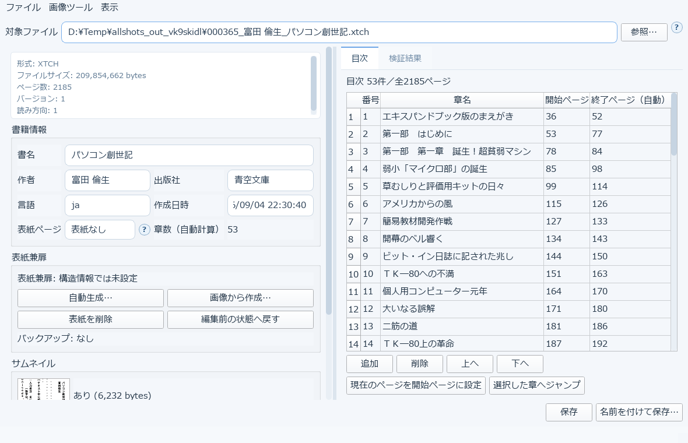
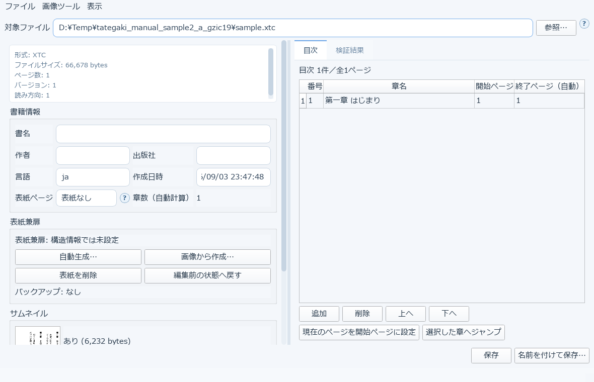
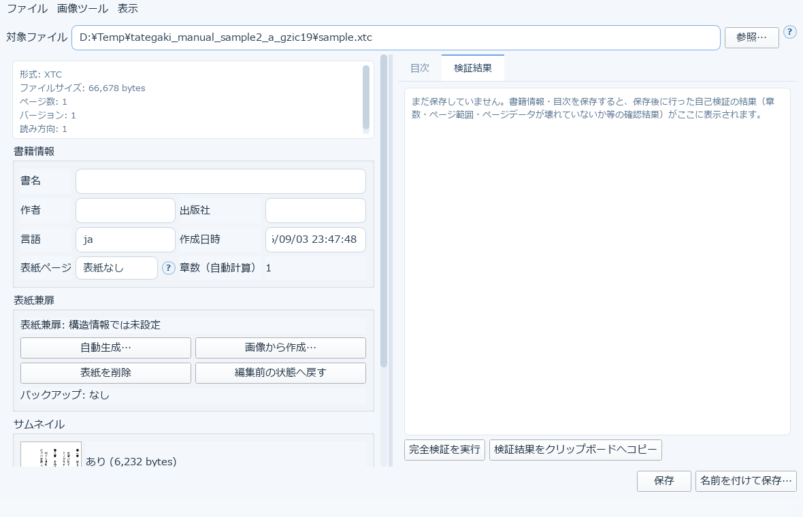
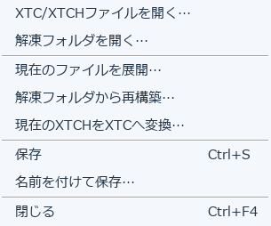
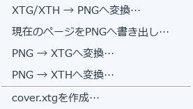

# 14. XTCツール

すでに作成したXTC / XTCH / XTG / XTH ファイルを開いて、**変換し直さずに**中身を編集できるツールです。
メイン画面とは別のウィンドウで開きます。

対象ファイルは、欄へドラッグ＆ドロップするか「参照…」から選びます。

読み込むと、形式・ファイルサイズ・ページ数・バージョン・読み方向といった基本情報と、
書籍情報・表紙兼扉・サムネイルが表示されます。

- **書籍情報** … 書名・作者・出版社・言語・作成日時をその場で編集できます
- **表紙ページ** … 表紙として扱うページを指定します
- **表紙兼扉** … 「自動生成…」「画像から作成…」「表紙を削除」「編集前の状態へ戻す」。
  編集前の状態は自動的にバックアップされます
- **サムネイル** … 埋め込まれているサムネイルを確認できます

## 目次タブ

章の一覧を、番号・章名・開始ページ・終了ページ（自動計算）の表で編集できます。

- **追加・削除・上へ・下へ** … 章の追加や並び替え
- **現在のページを開始ページに設定** … 表示中のページを、選択中の章の開始ページにします
- **選択した章へジャンプ** … 選んだ章の先頭ページへ移動します

## 検証結果タブ

書籍情報・目次を保存すると、保存後に行った自己検証の結果（章数・ページ範囲・ページデータが
壊れていないか等）がここに表示されます。

- **［完全検証を実行］** … いつでも手動で検証できます
- **［検証結果をクリップボードへコピー］** … 結果をそのままコピーできます

---

## 上部メニュー

XTCツールの機能の多くは、上部メニューにあります。

### ファイルメニュー

| 項目 | 内容 |
|---|---|
| XTC/XTCHファイルを開く… | 編集対象のファイルを開きます |
| 解凍フォルダを開く… | 展開済みのフォルダを読み込みます |
| 現在のファイルを展開… | 開いているファイルをフォルダへ展開します（ページを1枚ずつ取り出せます） |
| 解凍フォルダから再構築… | 展開したフォルダから、XTC/XTCHを組み直します |
| **現在のXTCHをXTCへ変換…** | 4階調のXTCHを2階調のXTCへ変換します |
| 保存 / 名前を付けて保存… | 上書き保存 / 別名保存 |
| 閉じる | ウィンドウを閉じます |

「展開 → 中の画像を差し替える → 再構築」という流れで、**ページ単位の差し替え**ができます。

### 画像ツールメニュー

| 項目 | 内容 |
|---|---|
| **XTG/XTH → PNGへ変換…** | XTG/XTH形式の画像ファイルを、普通のPNG画像に変換します |
| 現在のページをPNGへ書き出し… | 表示中のページを1枚のPNGとして保存します |
| **PNG → XTGへ変換…** | PNG画像をXTG（2階調）へ変換します |
| **PNG → XTHへ変換…** | PNG画像をXTH（4階調）へ変換します |
| **cover.xtgを作成…** | 外付けの表紙画像 `cover.xtg`（180×270）を作成します |

XTG/XTHはXTC/XTCHの中で使われている画像形式です。このメニューがあることで、

- 端末用の画像を単体で作る
- 中身の画像を取り出して確認する
- 表紙画像だけを差し替える

といった作業が、変換をやり直さずにできます。

> `cover.xtg` は**外付けの**表紙ファイルです。
> XTC/XTCHの内部に埋め込むサムネイルとは別物です（→ [8章](08-book-metadata.md#8-4-サムネイルタブ)）。

### 表示メニュー

- **メイン画面の前面に固定** … XTCツールのウィンドウを常にメイン画面より前に表示します

---

## 保存について

「保存」は元のファイルを上書きします。「名前を付けて保存…」は別ファイルとして保存します。
表紙編集前バックアップの上に保存しようとすると、複製してから編集するか確認されます
（バックアップ自体を上書きすることはできません）。

> 128MiB以上のファイルの書籍情報・目次保存はバックグラウンドで実行されます。
> 処理中は編集操作と終了が一時的に無効になります。
> **安全保存の途中でOSからプロセスを強制終了しないでください。**

→ [15. 大きなEPUBを巻分割する](15-epub-split.md)
