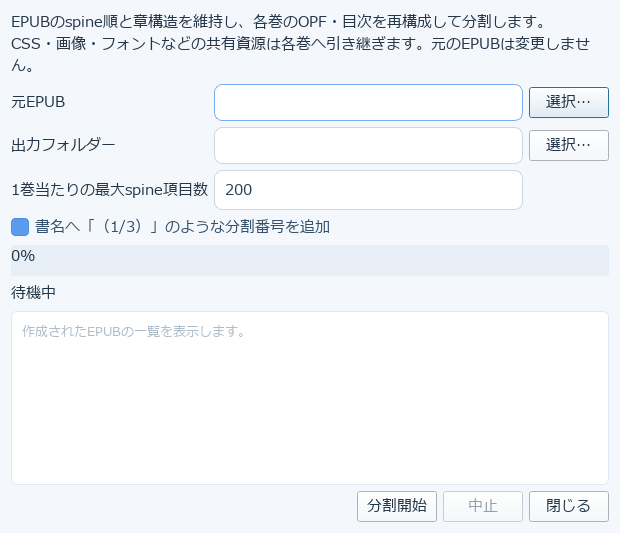
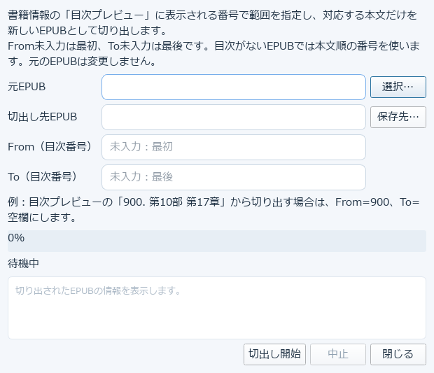

# 15. 大きなEPUBを巻分割する

長編のEPUBを、章構造を保ったまま複数巻に分割したり、必要な範囲だけを切り出したりできる
2つのツールです。どちらも元のEPUBは変更しません。

## EPUB分割

EPUBのspine順と章構造を維持し、各巻のOPF・目次を再構成して分割します。CSS・画像・フォントなどの
共有資源は各巻へ引き継ぎます。

1. **元EPUB**を選択します
2. **出力フォルダ**を選択します
3. **1巻当たりの最大spine項目数**を指定します（既定200）
4. 必要なら「書名へ『（1/3）』のような分割番号を追加」にチェックします
5. 「分割開始」を押します

完了すると、作成された各巻のEPUBが一覧に表示されます。

## EPUB切出し

書籍情報の「目次プレビュー」に表示される番号で範囲を指定し、対応する本文だけを新しいEPUBとして
切り出します。1冊の一部分だけを別ファイルにしたいときに使います。

1. **元EPUB**と**切出し先EPUB**（保存先）を選択します
2. **From（目次番号）**・**To（目次番号）**を指定します。From未入力は最初から、To未入力は最後まで。
   目次がないEPUBでは本文順の番号を使います
3. 「分割開始」に相当するボタンを押して実行します

例: 目次プレビューの「900. 第10部 第17章」から切り出す場合は、From=900、To=空欄にします。

→ [16. X3/X4へ接続して転送する](16-device-transfer.md)
