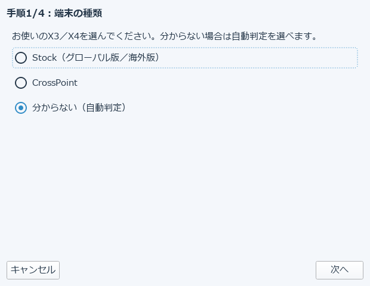

# 16. X3/X4へ接続して転送する

変換したXTC/XTCHを、X3・X4端末へWi-Fi経由で直接送信できます。初めて接続する端末は、
「X3/X4 かんたん接続ガイド」で4ステップの案内に沿って設定します。

## 接続ガイドの4ステップ

1. **端末の種類**: Stock（グローバル版／海外版）／CrossPoint／分からない（自動判定）から選びます
2. **X4とWindowsを接続**: 端末とパソコンをネットワーク的に繋ぎます
3. **自動診断**: 接続状況を自動的に確認します
4. **端末を登録**: 診断結果をもとに、端末をアプリへ登録します

一度登録すれば、次回からはこのガイドを経由せず直接送信できます。接続情報（ホスト名など）は
設定として保存されます。

## 送信

登録済みの端末には「X3/X4へ送信」から直接ファイルを送れます。詳しい送信手順は、実際に端末を
お持ちの際に画面の案内に沿って進めてください（本マニュアルでは接続ガイドの入口までを扱っています）。

→ [17. 版（エディション）の違い](17-editions.md)
