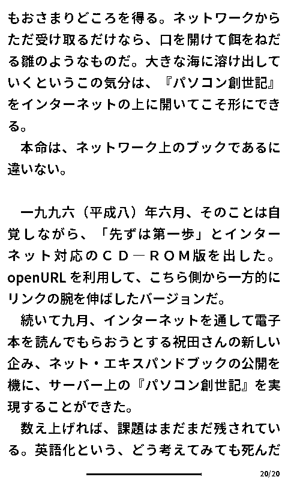
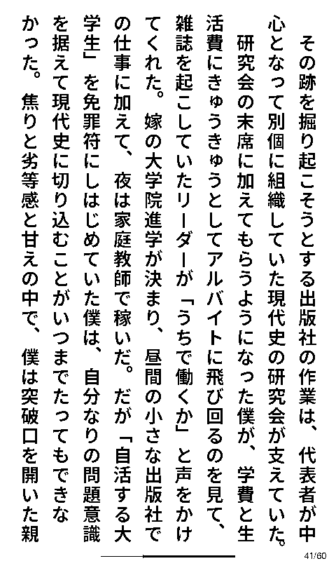
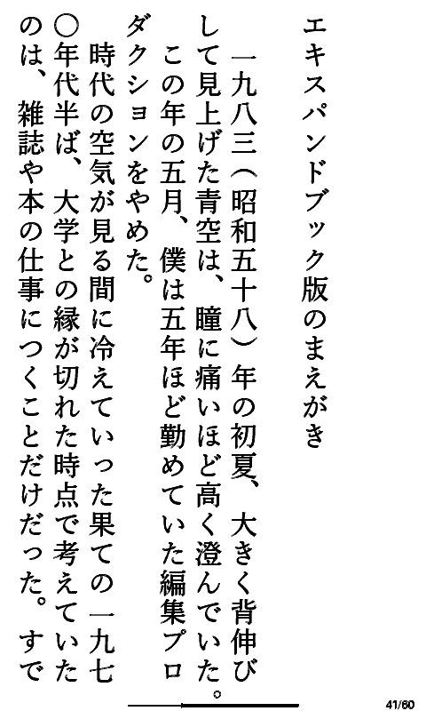
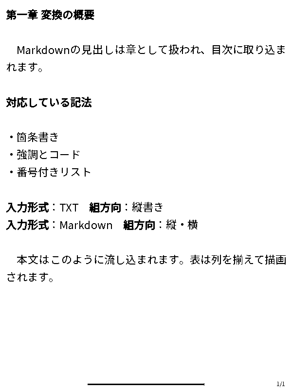
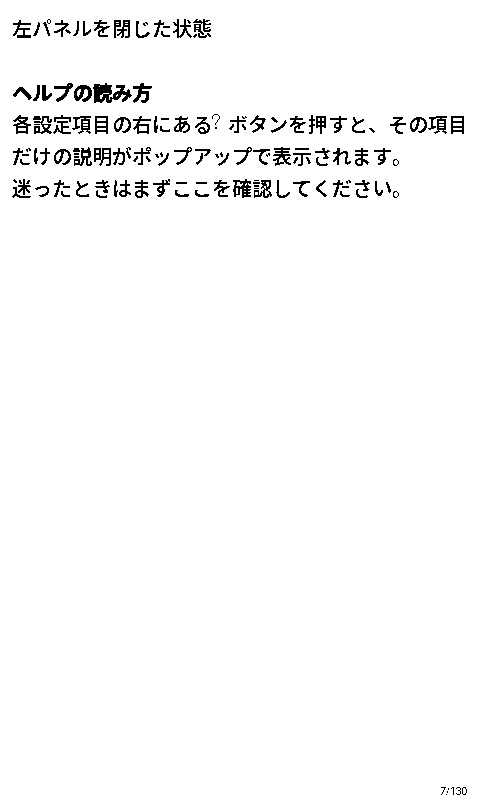
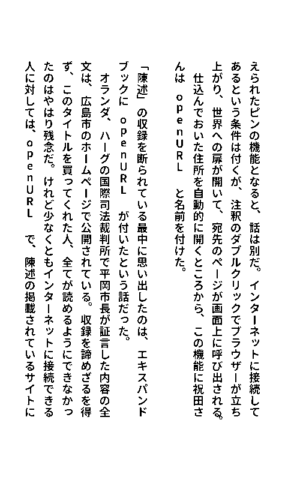

# 19. 変換後サンプル集

「設定を変えると出力がどう変わるのか」を、実際の出力ページで比べられるページです。

- すべて **実際に変換した結果**です（作図やモックアップではありません）
- ページサイズは **480×800px**（Xteink X4の実解像度）
- **このページの画像は縮小表示です。クリックすると原寸（480×800）で開きます**
  — 細部を見比べるときは必ず拡大してください
- 本文の元データは青空文庫の「[パソコン創世記](https://www.aozora.gr.jp/cards/000365/card1817.html)」（富田倫生）です

各サンプルの下に、その見た目を作っている設定へのリンクを置いています。

---

## 1. TXT・縦書き・ゴシック体（既定）

いちばん基本の出力です。既定のフォント（NotoSansJP-SemiBold）で組んでいます。

| 見えているもの | 設定場所 |
|---|---|
| 縦書きで右から左へ流れる本文 | [組方向](02-basic-settings.md#組方向画面の向き) |
| 本文の大きさ・行間・余白 | [フォント・サイズ・余白](03-typesetting.md#フォントサイズ余白) |
| 半角英字が縦に積まれている（openURL の部分） | [欧文表示](03-typesetting.md#文字組み) |
| 右下のページ番号 | [ページ表示](03-typesetting.md#ページ表示) |
| 下部の黒い横棒（読書位置） | [進捗バー](03-typesetting.md#進捗バー) |

## 2. TXT・横書き

同じ原稿を[横書き](02-basic-settings.md#組方向画面の向き)にしたものです。
資料やビジネス文書のように、横書きのほうが自然な原稿で使います。

---

## 3. 設定を煮詰めるとどう変わるか

**同じ本・同じ縦書きでも、設定を詰めるだけで読み心地は大きく変わります。**
下の2枚は、同じ本文を設定だけ変えて変換したものです。

### 既定のまま

### 設定を煮詰めた例

変えたのは次の5点です。

| 項目 | 既定 | 煮詰めた例 | ねらい |
|---|---|---|---|
| フォント | NotoSansJP-SemiBold（ゴシック） | **游明朝** | 長文の縦組みは明朝のほうが目が滑りにくい |
| 本文サイズ | 26 | **31** | 字面を大きくして、1行の文字数を抑える |
| 行間 | 44 | **40** | 文字を大きくしたぶん行の間隔を締め、行のつながりを保つ |
| 出力形式 | XTC（2階調） | **XTCH（4階調）** | 文字の輪郭がなめらかになる |
| 文字太らせ | なし | **6** | 明朝の細い横画がかすれるのを防ぐ |

フォント・サイズ・行間は [組版ブロック](03-typesetting.md#フォントサイズ余白)、
出力形式と文字太らせは [基本設定ブロック](02-basic-settings.md#機種出力形式) で設定します。

> **游明朝はWindowsに標準で入っているフォント**です（`C:\Windows\Fonts\yumin.ttf`）。
> アプリに同梱しているNotoフォント以外も、［参照…］から自由に選べます。

> **明朝体を使うときは「文字太らせ」との組み合わせが効きます。** 明朝は横画が細いため、
> 白黒2階調のままだと線がかすれがちです。4階調（XTCH）にして太らせを上げると、
> 紙に印刷したような落ち着いた字面になります。

> **正解は一つではありません。** 好みや端末、原稿の性格によって最適な値は変わります。
> [プレビュー](06-preview.md)を見ながら少しずつ動かして、自分の「読みやすい」を
> 見つけてください。気に入った組み合わせは[プリセット](07-presets.md)に保存できます。

---

## 4. Markdown（横書き・見出し階層・表罫線）

Markdownを横書きで変換すると、見出しが本文より大きく組まれ、表が罫線付きで描画されます。

| 見えているもの | 設定場所 |
|---|---|
| 見出しが本文より大きい | [見出しサイズ階層](03-typesetting.md#markdown専用設定横書き) |
| 章見出しの前で改ページ | [横書きMarkdown](03-typesetting.md#markdown専用設定横書き) |
| 表の格子状の罫線 | [表罫線](03-typesetting.md#markdown専用設定横書き) |
| 箇条書きの字下げ | [ネスト字下げ](03-typesetting.md#markdown専用設定横書き) |
| 見出しが目次に入る | [目次タブ](08-book-metadata.md#8-3-目次タブ) |

---

## 5. EPUBからの変換

EPUBを変換した例です（このマニュアルの[EPUB版](../download/)を変換しています）。
EPUB内の見出し・段落・画像がそのまま組版されます。

| 見えているもの | 設定場所 |
|---|---|
| EPUBの目次から章を取り込む | [目次タブ](08-book-metadata.md#8-3-目次タブ) |
| 大きなEPUBを巻に分ける | [EPUB分割](15-epub-split.md) |

---

## 6. 画像アーカイブ（ZIP / CBZ）

自炊した本や漫画のように、**1ページ＝1画像**のアーカイブを変換した例です。
ここでは実際のページ画像6枚をZIPにまとめ、変換しています。

### 標準

### 文字太らせ（4）

スキャン原稿は線が細って読みにくくなることがあります。
[文字太らせ](02-basic-settings.md#文字太らせ)を上げると線が力強くなります
（上の2枚を見比べてください）。ただし**挿絵や写真も一様に太る**点にご注意ください。

| 見えているもの | 設定場所 |
|---|---|
| ページの送り方向（右→左 / 左→右） | [ページ送り方向](02-basic-settings.md#ページ送り方向) |
| 線の太さ | [文字太らせ](02-basic-settings.md#文字太らせ) |
| 白黒への変換のしかた | [ディザリング・しきい値](03-typesetting.md#画像処理) |
| 紙の余白を削って本文を大きく | [余白トリミング](03-typesetting.md#画像処理) |
| 横長ページだけ回転 | [横長回転](03-typesetting.md#画像処理) |

> 画像アーカイブでは組版を行いません。Studioは縦書き・横書き・漫画かどうかの判定も
> 行わないため、ページ送り方向は手動で指定してください。

---

## 画面上での確認

出力ファイルを開かなくても、右ペインのプレビューで同じ見た目を確認できます。
変換前に設定を詰めるときは、[6. プレビュー（右ペイン）](06-preview.md)を活用してください。

実際の端末での大きさを確かめたいときは、プレビューの **［実寸］** を使います。

→ [目次に戻る](../README.md)
